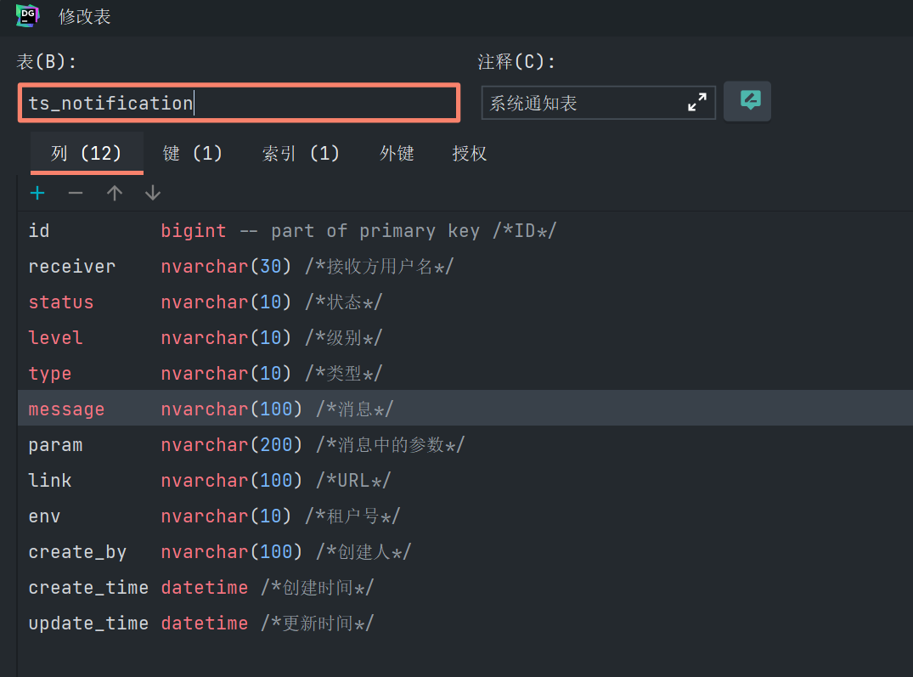

business文件夹(顾名思义：业务工具类的集合)

1、NotificationUtils类

使用此工具类将便捷的调用系统的通知服务
项目使用ts_notification表作为系统通知表

@Component
public class NotificationUtils {

    private static TsNotificationDao tsNotificationDao;
//    private static WsRemote wsRemote;

    public static void saveAndSend(TsNotification nt) {
        tsNotificationDao.save(nt);
        //wsRemote.send(nt);
    }

    public static void saveAndSendAll(List<TsNotification> nts) {
        if (Utils.isNotEmpty(nts)) {
            for (TsNotification nt : nts) {
                tsNotificationDao.save(nt);
                //wsRemote.send(nt);
            }
        }
    }

    @Autowired
    public void setTsNotificationDao(TsNotificationDao tsNotificationDao) {
        NotificationUtils.tsNotificationDao = tsNotificationDao;
    }

//    @Autowired
//    public void setWsRemote(WsRemote wsRemote) {
//        NotificationUtils.wsRemote = wsRemote;
//    }

}