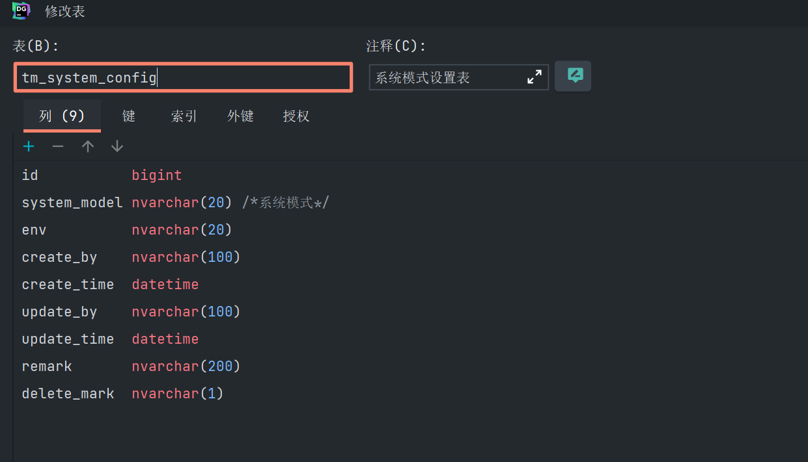

business文件夹(顾名思义：业务工具类的集合)

1、SystemUtils类

使用此工具类将便捷的调用系统的系统模式的配置
项目使用tm_system_config表作为系统模式设置表

// 公共方法：用来查询当前系统模式

@Component
public class SystemUtils {

    private static TmSystemConfigDao tmSystemConfigDao;

    public static String getSystemModel(){
        List<TmSystemConfig> tmSystemConfig = tmSystemConfigDao.findAll();
        return tmSystemConfig.get(0).getSystemModel();
    }

    @Autowired
    private void setTmSystemConfigDao(TmSystemConfigDao dao) {
        tmSystemConfigDao = dao;
    }
}