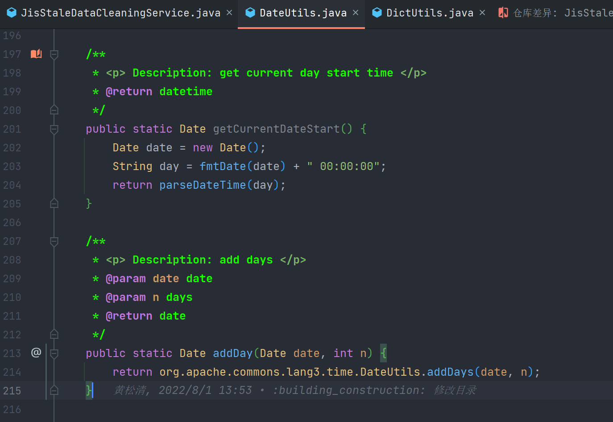
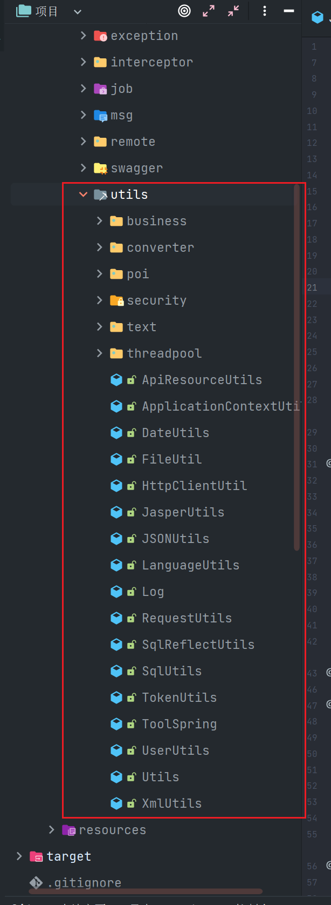

一、utils的接触和了解

1、utils的简介

utils层是一个常见的模块，用于封装一些通用的功能方法，以提供给项目中的其他模块使用。

2、utils的接触

因为没怎么了解项目的搭建，在之前的开发工作中，遇到一些功能开发过程中需要一些非空判断、日期、文件流以及计算上的操作，都是自己手动写一些转化等方法。不但
容易出错也比较繁琐。虽然知道有工具类可以使用，但是因为不熟悉其运用，一直不太关注和使用。

后面在和一位经验老道的同事共同开发JIS功能模块时，他看到了我的一段关于过期数据清理的功能时，发现我的Date类型的日期的加减天数是，通过Date转LocalDate
之后进行加减天数，再将LocalDate转换为Date类型时!(图1)。

提出为什么不同utils工具类中的 DateUtils.addDay(Date date, int n)方法时。

研究了这个方法的封装。发现其使用的Calendar进行天数的加减，比我自己写的简洁又高效。

通过我对utils的学习之路，发现utils里面都是一些开发中经常使用到的方法，并且都是静态方法，可以直接使用不需要用实体类去调用，值得我一个一个熟悉学习。

特此，专门用一章记录我对utils的学习和了解。

