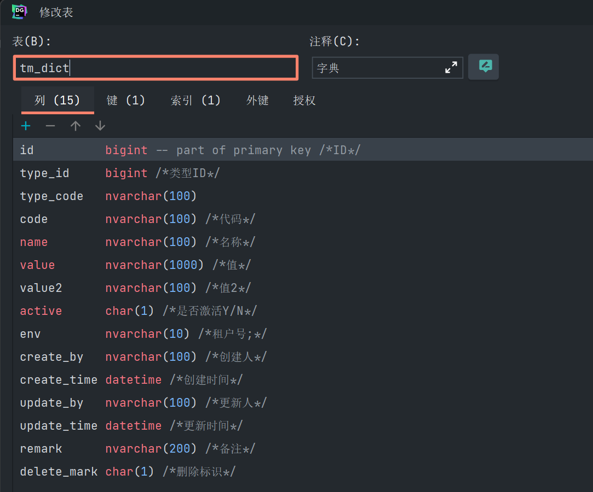

business文件夹(顾名思义：业务工具类的集合)

1、DictUtils类
使用此工具类便捷查询字典表

项目使用tm_dict表作为字典表

@Component
public class DictUtils {

    private static TmDictDao dictDao;

    // 通过dict_Type和code字段查询字段表
    public static String getValue(DictType type, String code) {
        return dictDao.getValueByTypeCodeAndCode(type.getCode(), code);
    }

    // 通过dict_Type和code、defalut_Value字段查询字段表
    public static String getValue(DictType type, String code, String defalutValue) {
        String value = getValue(type, code);
        if (null == value) {
            return defalutValue;
        }
        return value;
    }

    // 通过dict_Type字段查询字段表,返回List<TmDict>类型的数据
    public static List<TmDict> getDicts(DictType type) {
        return dictDao.findByTypeCode(type.getCode());
    }

    // 通过dict_Type字段查询字段表，返回Map<code, TmDict>类型的数据
    public static Map<String, TmDict> getDictMap(DictType type) {
        List<TmDict> dicts = getDicts(type);
        Map<String, TmDict> map = new HashMap<>();
        for (TmDict dict : dicts) {
            map.put(dict.getCode(), dict);
        }
        return map;
    }

    // 通过dict_Type字段查询字段表，返回Map<code, value>类型的数据
    public static Map<String, String> getValueMap(DictType type) {
        List<TmDict> dicts = getDicts(type);
        Map<String, String> map = new HashMap<>();
        for (TmDict dict : dicts) {
            map.put(dict.getCode(), dict.getValue());
        }
        return map;
    }

    /**
     * 
Description: set DictDao

     * @param dao DictDao
     */
    // 自动注册，将 private static TmDictDao dictDao;的static的对象set以供其对象使用（static对象无法@Autowired）
    @Autowired
    private void setDictDao(TmDictDao dao) {
        dictDao = dao;
    }
}

