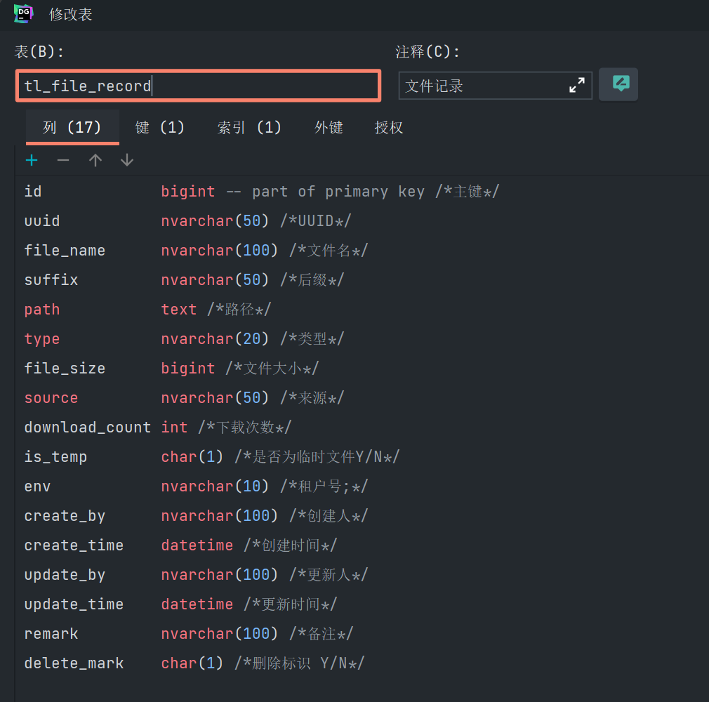

business文件夹(顾名思义：业务工具类的集合)

1、FileRecordUtils类
使用此工具类便捷记录业务中的文件情况
项目使用tl_file_record表作为文件记录表

@Component
public class FileRecordUtils {

    private static TlFileRecordDao tlFileRecordDao;

    public static String getPath(String folder) {
        String path = DictUtils.getValue(DictType.FOLDER, folder);
        if (null == path || path.equals(folder)) {
            throw BusinessErrorException.msg("err.path");
        }
        path = FileUtil.createPath(path);
        return path;
    }

    public static String getDatePath(String folder) {
        String path = DictUtils.getValue(DictType.FOLDER, folder);
        if (null == path || path.equals(folder)) {
            throw BusinessErrorException.msg("err.path");
        }
        path = FileUtil.createDatePath(path);
        return path;
    }

    public static FileIdVo saveTemp(String path, String type, String source) {
        String filename = FileUtil.getFileName(path);

        return saveTemp(filename, path, type, source);
    }

    public static FileIdVo save(String path, String type, String source) {
        String filename = FileUtil.getFileName(path);

        return save(filename, path, type, source, Const.NO, UserUtils.getUser());
    }

    public static FileIdVo saveSys(String path, String type, String source) {
        String filename = FileUtil.getFileName(path);

        return save(filename, path, type, source, Const.NO, null);
    }

    public static FileIdVo saveTemp(String filename, String path, String type, String source) {
        return save(filename, path, type, source, Const.YES, UserUtils.getUser());
    }

    public static FileIdVo save(String filename, String path, String type, String source, String temp, String user) {
        TlFileRecord record = new TlFileRecord();
        record.init(user);
        record.setUuid(getUuid(path));
        File file = new File(path);
        record.setFileName(filename);
        record.setPath(path);
        record.setType(type);
        record.setSuffix(FileUtil.getSuffix(filename));
        record.setFileSize(file.length());
        record.setSource(source);
        record.setDownloadCount(0);
        record.setIsTemp(temp);
        tlFileRecordDao.save(record);

        return new FileIdVo(record.getId(), record.getUuid(), record.getFileName());
    }

    public static String getUuid(String path) {
        if (StringUtils.isNotBlank(path)) {
            if (-1 != path.indexOf(File.separator)) {
                path = path.substring(0, path.lastIndexOf(File.separator));
                return path.substring(path.lastIndexOf(File.separator) + 1);
            } else if (-1 != path.indexOf("/")) {
                path = path.substring(0, path.lastIndexOf("/"));
                return path.substring(path.lastIndexOf("/") + 1);
            } else if (-1 != path.indexOf("\\")) {
                path = path.substring(0, path.lastIndexOf("\\"));
                return path.substring(path.lastIndexOf("\\") + 1);
            }
        }
        return path;
    }

    /**
     * 
Description: set dao

     * @param dao TlFileRecordDao
     */
    @Autowired
    private void setDao(TlFileRecordDao dao) {
        tlFileRecordDao = dao;
    }

}
