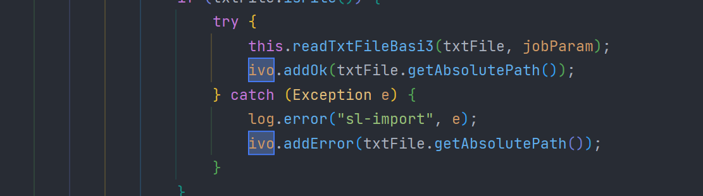

business文件夹(顾名思义：业务工具类的集合)

1、FileRecordUtils类

使用此工具类将文件移动到备份目录和错误目录

使用实例：

*getAbsolutePath()：获取文件绝对路径

利用try{}catch(){}
当addOK(txtFile.getAbsolutePath()时,程序执行正常，文件被移动到备份目录
当addError(txtFile.getAbsolutePath()时，程序执行异常，文件被移动到错误目录

public class ImpFileUtils {

    public static void moveFile(ImpFileVo ivo, String dir, String type, String errorType, String source) throws IOException {
        // 移动到备份目录
        if (Utils.isNotEmpty(ivo.getOk())) {
            String folder = FileUtil.createPath(FileUtil.getBackup(dir));
            for (String path : ivo.getOk()) {
                File dest = new File(folder.concat(File.separator).concat(FileUtil.getFileName(path)));
                FileUtils.moveFile(new File(path), dest);
                FileRecordUtils.saveSys(dest.getAbsolutePath(), type, source);
            }
        }

        // 移动到错误目录
        if (Utils.isNotEmpty(ivo.getError())) {
            String folder = FileUtil.createPath(FileUtil.getError(dir));
            for (String path : ivo.getError()) {
                File dest = new File(folder.concat(File.separator).concat(FileUtil.getFileName(path)));
                FileUtils.moveFile(new File(path), dest);
                FileRecordUtils.saveSys(dest.getAbsolutePath(), errorType, source);
            }
        }
    }

    public static void moveFile(ImpFileVo ivo, String dir, String type, String errorType, String source, Map<String, TlMessageLog> messageMap) throws IOException {
        // 移动到备份目录
        if (Utils.isNotEmpty(ivo.getOk())) {
            String folder = FileUtil.createPath(FileUtil.getBackup(dir));
            for (String path : ivo.getOk()) {
                File dest = new File(folder.concat(File.separator).concat(FileUtil.getFileName(path)));
                FileUtils.moveFile(new File(path), dest);
                FileIdVo fileIdVo = FileRecordUtils.saveSys(dest.getAbsolutePath(), type, source);
                messageMap.get(fileIdVo.getName()).setFileId(fileIdVo.getId());
                messageMap.get(fileIdVo.getName()).setFileUuid(fileIdVo.getUuid());
                messageMap.get(fileIdVo.getName()).setPath(folder);
            }
        }

        // 移动到错误目录
        if (Utils.isNotEmpty(ivo.getError())) {
            String folder = FileUtil.createPath(FileUtil.getError(dir));
            for (String path : ivo.getError()) {
                File dest = new File(folder.concat(File.separator).concat(FileUtil.getFileName(path)));
                FileUtils.moveFile(new File(path), dest);
                FileIdVo fileIdVo = FileRecordUtils.saveSys(dest.getAbsolutePath(), errorType, source);
                messageMap.get(fileIdVo.getName()).setFileId(fileIdVo.getId());
                messageMap.get(fileIdVo.getName()).setFileUuid(fileIdVo.getUuid());
                messageMap.get(fileIdVo.getName()).setPath(folder);
            }
        }
    }

}