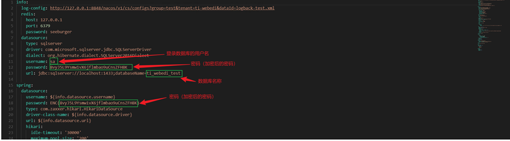
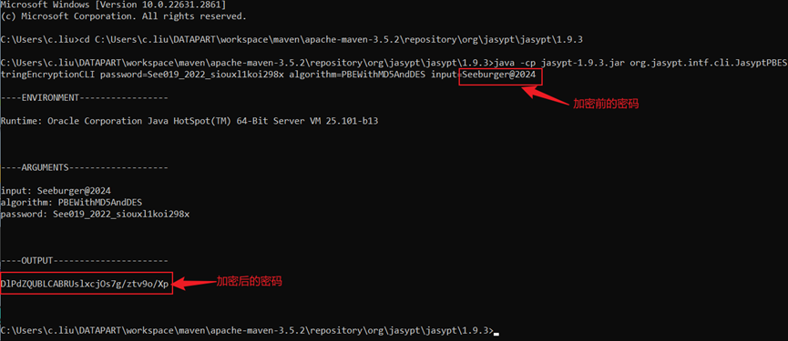
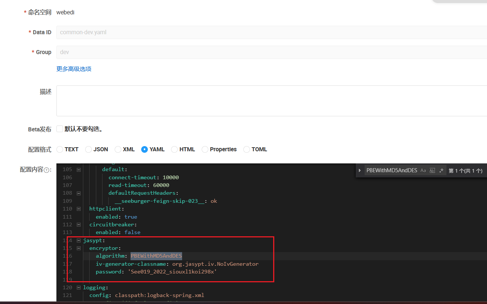

对数据库密码进行加密过程如下：
进入jasypt-1.9.3.jar所在的目录，再打开命令行窗口，执行该命令：
java -cp jasypt-1.9.3.jar org.jasypt.intf.cli.JasyptPBEStringEncryptionCLI password=See019_2022_siouxl1koi298x algorithm=PBEWithMD5AndDES input=数据库密码

