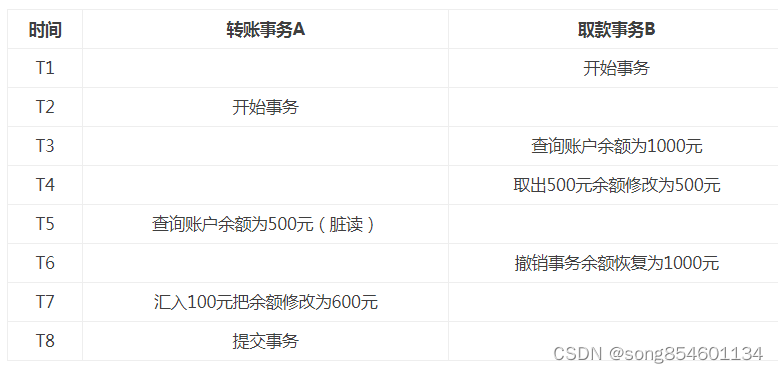
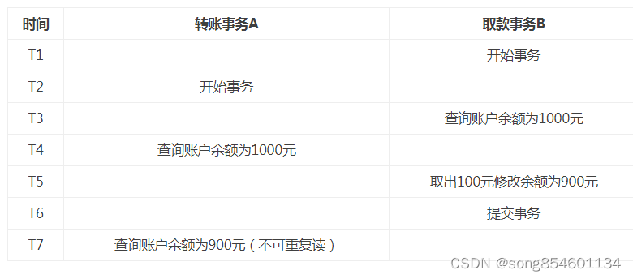
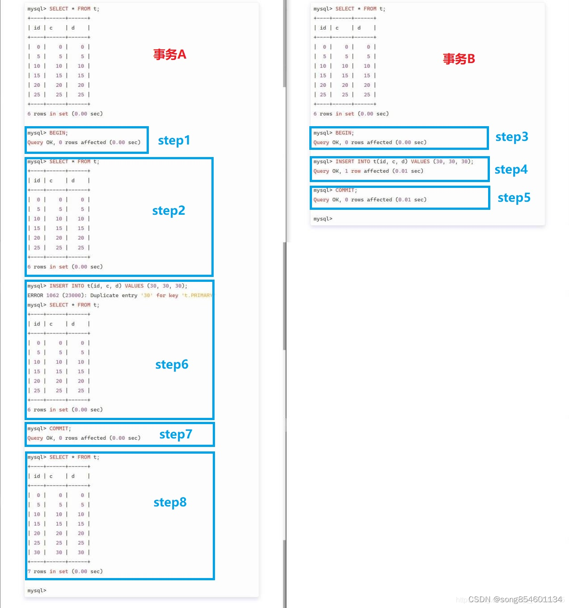
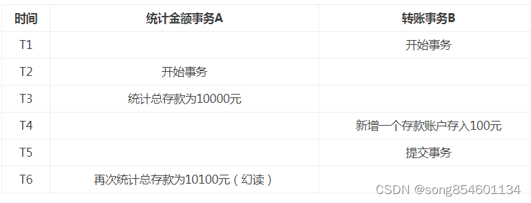
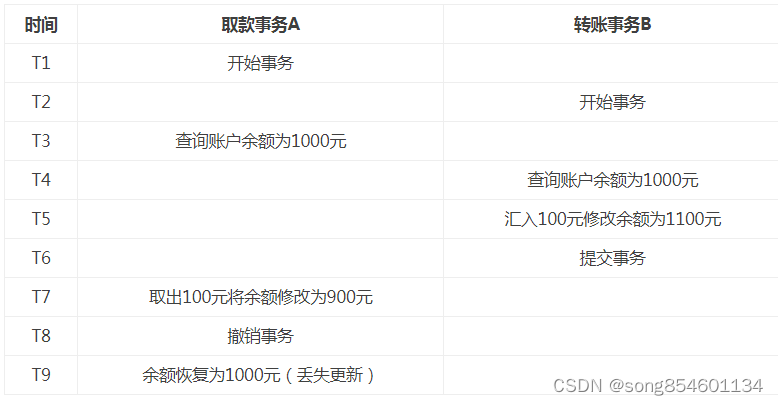
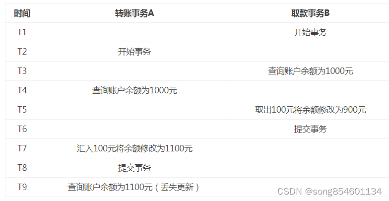

一、脏读、幻读和不可重复读

1、脏读：

    脏读就是指当一个事务正在访问数据，并且对数据进行了修改，而这种修改还没有提交到数据库中，
    这时，另外一个事务也访问这个数据，然后使用了这个数据。

这个图对应的数据库隔离机制为“读为提交”

    解决办法：如果在第一个事务提交前，任何其他事务不可读取其修改过的值，则可以避免该问题。

2、不可重复读：

    是指在一个事务内，多次读同一数据。在这个事务还没有结束时，另外一个事务也访问该同一数据。
    那么，在第一个事务中的两次读数据之间，由于第二个事务的修改，那么第一个事务两次读到的的数据可能是不一样的。
    这样就发生了在一个事务内两次读到的数据是不一样的，因此称为是不可重复读。

这个图对应的数据库隔离机制为读已提交或者读未提交一定不是可重复读，因为可重复机制下，同一个事务多次读同一数据读取到的结果是
一样的，所以即使事务B修改数据后，A事务再去读取，由于A还没有提交事务，所以读到的结果是一样的

    解决办法：如果只有在修改事务完全提交之后才可以读取数据，则可以避免该问题。

3、幻读：

    说法一：事务 A 根据条件查询得到了 N 条数据，但此时事务 B 删除或者增加了 M 条符合事务 A 查询条件的数据，
    这样当事务 A 再次进行查询的时候真实的数据集已经发生了变化，但是A却查询不出来这种变化，因此产生了幻读。

这一种说法强调幻读在于某一个范围内的数据行变多或者是变少了，侧重说明的是数据集不一样导致了产生了幻读。

    说法二：幻读并不是说两次读取获取的结果集不同，幻读侧重的方面是某一次的 select 操作得到的结果所表征的数据状态无法
    支撑后续的业务操作。更为具体一些：A事务select 某记录是否存在，结果为不存在，准备插入此记录，但执行 insert 时发现
    此记录已存在，无法插入，此时就发生了幻读。产生这样的原因是因为有另一个事务往表中插入了数据。

说法二这种情况也属于幻读，说法二归根到底还是数据集发生了改变，查询得到的数据集与真实的数据集不匹配。

对于说法二：当进行INSERT的时候，也需要隐式的读取，比如插入数据时需要读取有没有主键冲突，然后再决定是否能执行插入。如果这时发现已经有这个记录了，就没法插入。所以，SELECT 显示不存在，但是INSERT的时候发现已存在，说明符合条件的数据行发生了变化，也就是幻读的情况，而不可重复读指的是同一条记录的内容被修改了。

举例来说明：说法二说的是如下的情况(隔离机制为可重复读)：
有两个事务A和B，A事务先开启，然后A开始查询数据集中有没有id = 30的数据，查询的结果显示数据中没有id = 30的数据。紧接着又有一个事务B开启了，B事务往表中插入了一条id = 30的数据，然后提交了事务。然后A再开始往表中插入id = 30的数据，由于B事务已经插入了id = 30的数据，自然是不能插入，紧接着A又查询了一次，结果发现表中没有id = 30的数据呀，A事务就很纳闷了，怎么会插入不了数据呢。当A事务提交以后，再次查询，发现表中的确存在id = 30的数据。但是A事务还没提交的时候，却查不出来？
其实，这便是可重复读的作用。

简单来说：

    幻读是说数据的条数发生了变化，原本不存在的数据存在了。不可重复读是说数据的内容发生了变化，原本存在的数据的内容发生了改变。

再例如：

这个图对应的数据库隔离机制为读已提交或者读未提交一定不是可重复读
    
事务B新增了数据记录行，所以属于幻读，不属于不可重复读

    解决办法：如果在操作事务完成数据处理之前，任何其他事务都不可以添加新数据，则可避免该问题。

4、提醒

不可重复度主要是对一条数据行查询，同样的条件，你读取过的数据，再次读取出来发现值不一样了进行查询，不可重复读的重点是修改，
而幻读指的是两次查询(可能对象是n条记录)获取的结果集不同（因为另一个事务新增或者删除记录行）

5、第一类丢失更新(回滚覆盖)

A事务撤销时，把已经提交的B事务的更新数据覆盖了。例如：

6、第二类丢失更新( 提交覆盖)

A事务覆盖B事务已经提交的数据，造成B事务所做的操作丢失

