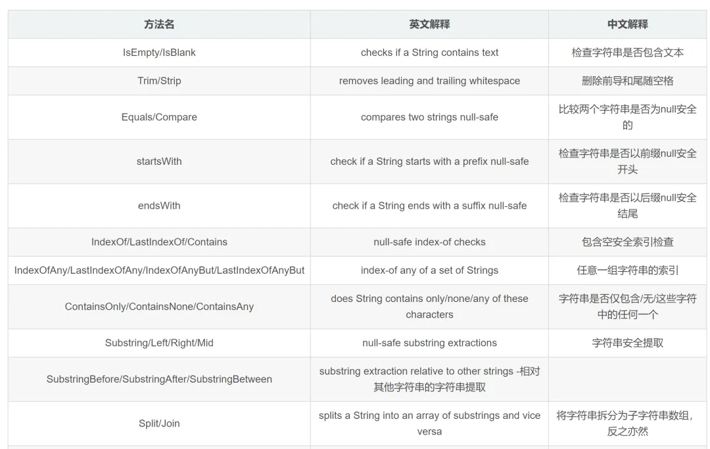

org.apache.commons.lang3.StringUtils工具类中的方法：

isEmpty/isNotEmpty/isNotBlank/isBlank/isAnyEmpty/isNoneEmpty/isAnyBlank/isNoneBlank

日常使用中会忽视isEmpty和isBank相互之间的区别，此次进行回顾汇总
isEmpty（）是把空格也看作非NULL，isBank()则是将空格看作NULL

一、isEmpty系列

1、StringUtils.isEmpty（）

是否为空. 可以看到 " " 空格是会绕过这种空判断,因为是一个空格,并不是严格的空值,会导致 isEmpty(" ")=false

    StringUtils.isEmpty(null) = true
    StringUtils.isEmpty("") = true
    StringUtils.isEmpty(" ") = false
    StringUtils.isEmpty(“bob”) = false
    StringUtils.isEmpty(" bob ") = false

2、StringUtils.isNotEmpty（）

相当于不为空 , = !isEmpty()

    public static boolean isNotEmpty(final CharSequence cs) {
        return !isEmpty(cs);
    }

3、StringUtils.isAnyEmpty（）

判断多个字符串，如果有一个为空 即返回true。

    StringUtils.isAnyEmpty(null) = true
    StringUtils.isAnyEmpty(null, “foo”) = true
    StringUtils.isAnyEmpty("", “bar”) = true
    StringUtils.isAnyEmpty(“bob”, “”) = true
    StringUtils.isAnyEmpty(" bob ", null) = true
    StringUtils.isAnyEmpty(" ", “bar”) = false
    StringUtils.isAnyEmpty(“foo”, “bar”) = false

4、StringUtils.isNoneEmpty（）

相当于!isAnyEmpty(css) , 必须所有的值都不为空才返回true

二、isBank系列

1、StringUtils.isBlank（）

是否为真空值(空格也视为null)
    
    StringUtils.isBlank(null) = true
    StringUtils.isBlank("") = true
    StringUtils.isBlank(" ") = true
    StringUtils.isBlank(“bob”) = false
    StringUtils.isBlank(" bob ") = false

2、StringUtils.isNotBlank（）

是否真的不为空,不是空格或者空值 ,相当于!isBlank();

3、StringUtils.isAnyBlank（）

是否包含任何真空值(包含空格或空值)

    StringUtils.isAnyBlank(null) = true
    StringUtils.isAnyBlank(null, “foo”) = true
    StringUtils.isAnyBlank(null, null) = true
    StringUtils.isAnyBlank("", “bar”) = true
    StringUtils.isAnyBlank(“bob”, “”) = true
    StringUtils.isAnyBlank(" bob ", null) = true
    StringUtils.isAnyBlank(" ", “bar”) = true
    StringUtils.isAnyBlank(“foo”, “bar”) = false

4、StringUtils.isNoneBlank（）

是否全部都不包含空值或空格

三、StringUtils的其他方法

