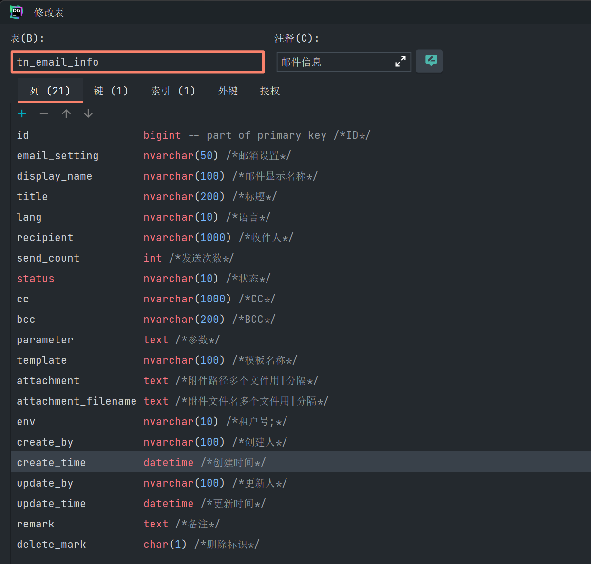
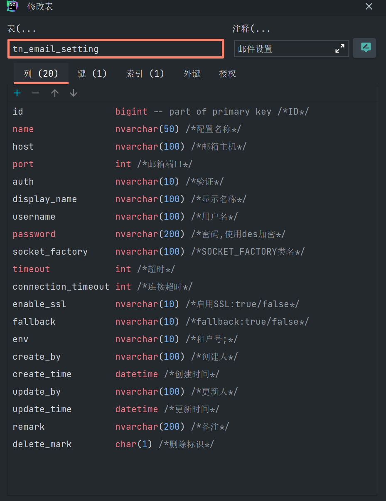
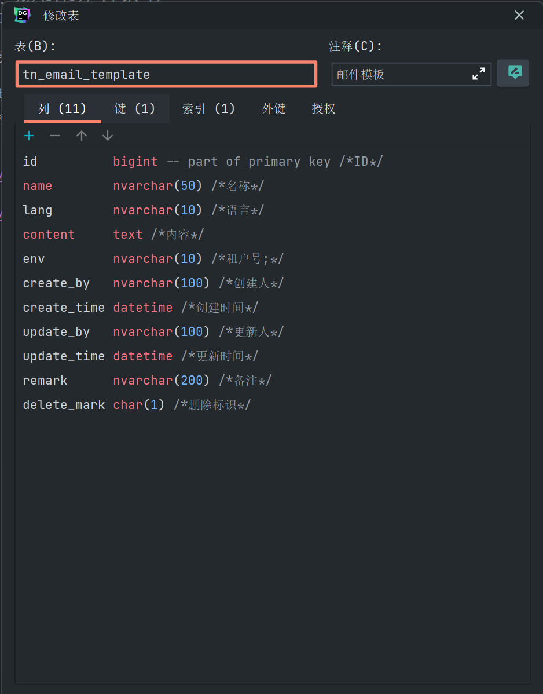

<!--
 * @Author: ZhangShaoshuai Zss_gege@163.com
 * @Date: 2023-11-27 15:02:09
 * @LastEditors: ZhangShaoshuai Zss_gege@163.com
 * @LastEditTime: 2023-11-28 14:08:30
 * @FilePath: \Blog\1-项目总结复盘\2-邮箱模块的搭建和构造\1-邮箱模块的搭建.md
-->
基于Java Web的电子邮件服务的设计与实现

1、邮件模块的功能

    a、各个业务模块将需要发送到邮件数据存储到 tn_email_info表中
    b、对邮箱服务进行相关设置 
    c、根据时间状态判断出需要 发送、修改业务数据邮件 （多线程的运用）(发送的邮件较多，分为list、ready两种类型，防止一次发送过多导致超时)
    d、发送邮件 
    
 

 
 
 

2、用到的技术栈
    a、多线程
    b、解密
    c、MQ
    

3、邮箱格式是否正确验证：    邮件格式正则
    private static String reg = "^((\\s*)?[\\.A-Za-z0-9_-]+@([A-Za-z0-9_-]+\\.)+[A-Za-z]{1,9}(\\s*)?(\\s*;\\s*)?)+$";

    /**
     * 
Description: 验证邮箱地址是否正确

     * @param email 地址
     * @return 数据
     */
    public static boolean validateEmail(String email) {
        if (null == email) {
            return false;
        }
        return email.matches(reg);
    }

4、邮箱服务的启动方式（ApplicationRunner用法）

        1. 类型：接口
        2. 方法：只定义了一个run方法
        3. 使用场景：
        springBoot项目启动时，若想在启动之后直接执行某一段代码，就可以用 ApplicationRunner这个接口，并实现接口里面的run(ApplicationArguments args)方法，方法中写上自己的想要的代码逻辑。

    @Component  //此类一定要交给spring管理
    public class ConsumerRunner implements ApplicationRunner{
        @Override
        public void run(ApplicationArgumers args) throws Exception{
            //代码
            System.out.println("需要在springBoot项目启动时执行的代码---");
        }
    }

若有多个代码段需要执行，可用@Order注解设置执行的顺序。

    @Component  //此类一定要交给spring管理
    @Order(value=1) //首先执行
    public class ConsumerRunnerA implements ApplicationRunner{
        @Override
        public void run(ApplicationArgumers args) throws Exception{
            //代码
            System.out.println("需要在springBoot项目启动时执行的代码1---");
        }
    }

    @Component  //此类一定要交给spring管理
    @Order(value=2) //其次执行
    public class ConsumerRunnerB implements ApplicationRunner{
        @Override
        public void run(ApplicationArgumers args) throws Exception{
            //代码
            System.out.println("需要在springBoot项目启动时执行的代码2---");
        }
    }