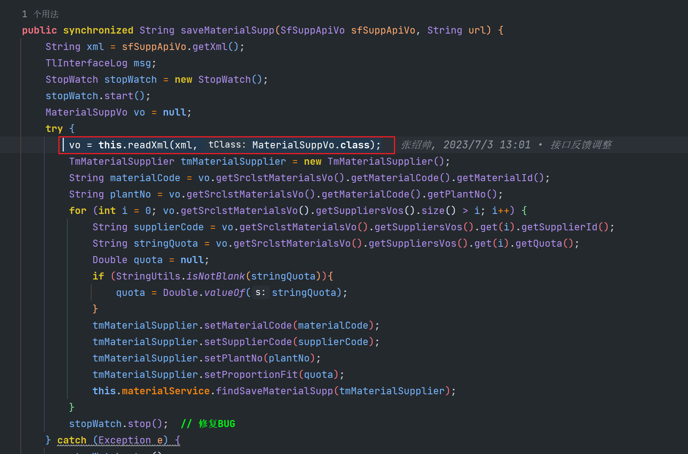

举例报文内容如下：

    <document>
        <Materials>
            <Material>
                <Material_ID>11H035335</Material_ID>
                <PlantNo>HE01</PlantNo>
            </Material>
            <Supplier>
                <Unit>PCE</Unit>
                <Supplier_ID>00F00003</Supplier_ID>
                <Quota>57.1</Quota>
            </Supplier>
            <Supplier>
                <Unit>PCE</Unit>
                <Supplier_ID>00F00133</Supplier_ID>
                <Quota>42.9</Quota>
            </Supplier>
        </Materials>
    </document>

先新建对应报文的接收对象

    @Data
    @XStreamAlias("document")
    public class MaterialSuppVo {
        @XStreamAlias("Materials")
        private SrclstMaterialsVo srclstMaterialsVo;
    }

    @Data
    @XStreamAlias("Materials")
    public class SrclstMaterialsVo {
        @XStreamAlias("Material")
        private SrclstMaterialVo materialCode;
        @XStreamImplicit(itemFieldName = "Supplier")
        private List<SuppliersVo> suppliersVos;
    }

    @Data
    @XStreamAlias("Material")
    public class SrclstMaterialVo {
        @XStreamAlias("Material_ID")
        private String materialId;
        @XStreamAlias("PlantNo")
        private String plantNo;
    }

    @Data
    @XStreamAlias("Supplier")
    public class SuppliersVo {
        @XStreamAlias("Unit")
        private String unit;
        @XStreamAlias("Supplier_ID")
        private String supplierId;
        @XStreamAlias("Quota")
        private String quota;
    }

调用readXml公共方法，即可解析xml报文中的数据到对象中

    private <T> T readXml(String xml, Class<T> tClass) {
        XStream xstream = new XStream();
        xstream.ignoreUnknownElements();
        xstream.addPermission(AnyTypePermission.ANY);
        xstream.processAnnotations(tClass);
        xstream.registerConverter(new CustomDateConverter());
        xstream.registerConverter(new CustomIntConverter());
        @SuppressWarnings("unchecked")
        T vo = (T) xstream.fromXML(xml);
        return vo;
    }