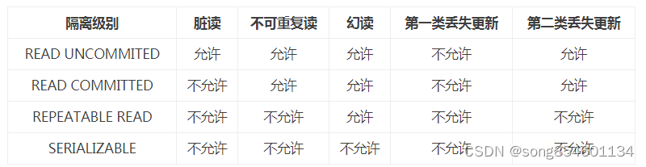
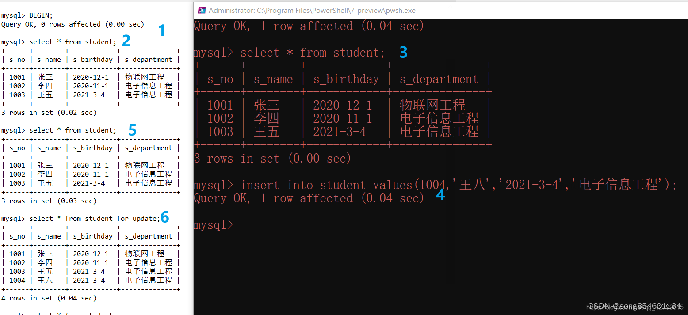
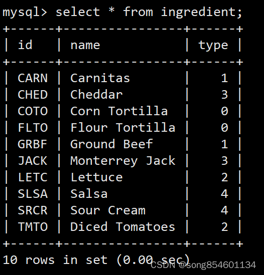
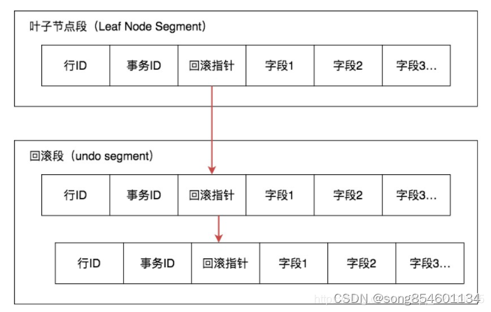
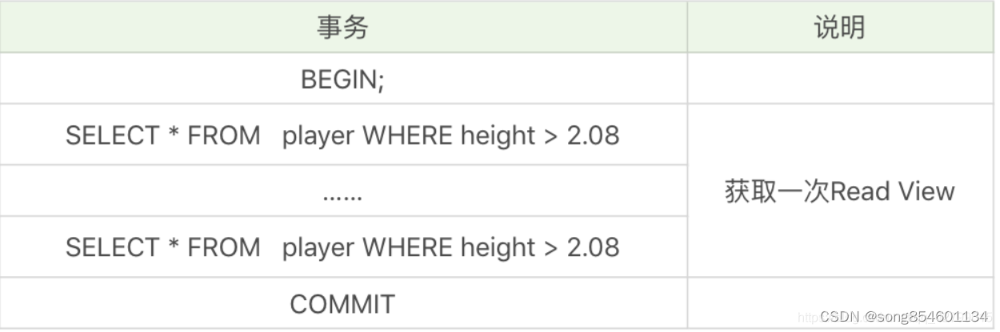

为了解决上述问题，数据库通过锁机制解决并发访问的问题。根据锁定对象不同：分为行级锁和表级锁；根据并发事务锁定的关系上看：分为共享锁定和独占锁定，共享锁定会防止独占锁定但允许其他的共享锁定。而独占锁定既防止共享锁定也防止其他独占锁定。为了更改数据，数据库必须在进行更改的行上施加行独占锁定，insert、update、delete和selsct for update语句都会隐式采用必要的行锁定。

但是直接使用锁机制管理是很复杂的，基于锁机制，数据库给用户提供了不同的事务隔离级别，只要设置了事务隔离级别，数据库就会分析事务中的sql语句然后自动选择合适的锁。
不同的隔离级别对并发问题的解决情况如图：

* Read uncommitted(未授权读取、读未提交)：

如果一个事务已经开始写数据，则另外一个事务则不允许同时进行写操作，但允许其他事务读此行数据。
该隔离级别可以通过“排他写锁”实现。这样就避免了更新丢失，却可能出现脏读。也就是说事务B读取到了事务A未提交的数据。

* Read committed（授权读取、读提交）：

读取数据的事务允许其他事务继续访问该行数据，但是未提交的写事务将会禁止其他事务访问该行。该隔离级别避免了脏读，但是却可能出现不可重复读。
事务A事先读取了数据，事务B紧接了更新了数据，并提交了事务，而事务A再次读取该数据时，数据已经发生了改变。

* Repeatable read（可重复读取）：

可重复读是指在一个事务内，多次读同一数据。在这个事务还没有结束时，另外一个事务也访问该同一数据。那么，在第一个事务中的两次读数据之间，
即使第二个事务对数据进行修改，第一个事务两次读到的的数据是一样的。这样就发生了在一个事务内两次读到的数据是一样的，因此称为是可重复读。读取数据的事务将会禁止写事务（但允许读事务），写事务则禁止任何其他事务。这样避免了不可重复读取和脏读，但是有时可能出现幻象读。（读取数据的事务）这可以通过“共享读锁”和“排他写锁”实现。

* Serializable（序列化）：

提供严格的事务隔离。它要求事务序列化执行，事务只能一个接着一个地执行，但不能并发执行。如果仅仅通过“行级锁”是无法实现事务序列化的，
必须通过其他机制保证新插入的数据不会被刚执行查询操作的事务访问到。序列化是最高的事务隔离级别，同时代价也花费最高，性能很低，一般很少使用，在该级别下，事务顺序执行，不仅可以避免脏读、不可重复读，还避免了幻像读。

    注意：事务的隔离级别和数据库并发性是成反比的，隔离级别越高，并发性越低。。对于多数应用程序，可以优先考虑把数据库系统的隔离级别设为Read Committed。
    它能够避免脏读取，而且具有较好的并发性能。尽管它会导致不可重复读、幻读和第二类丢失更新这些并发问题，在可能出现这类问题的个别场合，可以由应用程序采用悲观锁或乐观锁来控制。大多数数据库的默认级别就是Read committed，比如Sql Server , Oracle。MySQL的默认隔离级别就是Repeatable read。

可重复读隔离下为什么会产生幻读？

    在可重复读隔离级别下，普通的查询是快照读，是不会看到别的事务插入的数据的。因此，幻读在 当前读 下才会出现。

什么是快照读，什么是当前读？

    快照读读取的是快照数据。不加锁的简单的 SELECT都属于快照读，比如这样：

`SELECT * FROM player WHERE ...`

当前读就是读取最新数据，而不是历史版本的数据。加锁的 SELECT，或者对数据进行增删改都会进行当前读。这有点像是 Java 中的 volatile 关键字
，被 volatile 修饰的变量，进行修改时，JVM 会强制将其写回内存，而不是放在 CPU 缓存中，进行读取时，JVM 会强制从内存读取，而不是放在 CPU 缓存中。
这样就能保证其可见行，保证每次读取到的都是最新的值。如果没有用 volatile 关键字修饰，变量的值可能会被放在 CPU 缓存中，这就导致读取到的值可能是某次修改的值，不能保证是最新的值。

说多了，我们继续来看，如下的操作都会进行 当前读。

`SELECT * FROM player LOCK IN SHARE MODE;`

`SELECT * FROM player FOR UPDATE;`

`INSERT INTO player values ...`

`DELETE FROM player WHERE ...`

`UPDATE player SET ...`

说白了，快照读就是普通的读操作，而当前读包括了 加锁的读取 和 DML（DML只是对表内部的数据操作，不涉及表的定义，结构的修改。主要包括insert、update、deletet） 操作。

比如在可重复读的隔离条件下，我开启了两个事务，在另一个事务中进行了插入操作，当前事务如果使用当前读 是可以读到最新的数据的。

### MVCC（多版本并发控制）

    MVCC，全称为 Multi Version Concurrency Control，翻译过来就是多版本并发控制。最早的数据库只支持并发读读，不支持并发读写和写写，MVCC 的引入就是为了解决并发读写

MySQL中如何实现可重复读
    
    当隔离级别为可重复读(RR)的时候，事务只在第一次 SELECT 的时候会获取一次 Read View，而后面所有的 SELECT 都会复用这个 Read View；当隔离机制为RC时候，每次查询都会创建一份 Read View。也就是说：对于A事务而言，不管其他事务怎么修改数据，对于A事务而言，它能看到的数据永远都是第一次SELECT时看到的数据。这显然不合理，如果其它事务插入了数据，A事务却只能看到过去的数据，读取不了当前的数据。
    
    既然都说到 Read View 了，就不得不说 MVCC (多版本并发控制) 机制了。MVCC 其实字面意思还比较好理解，为了防止数据产生冲突，我们可以使用时间戳之类的来进行标识，不同的时间戳对应着不同的版本。比如你现在有1000元，你借给了张三 500 元， 之后李四给了你 500 元，虽然你的钱的总额都是 1000元，但是其实已经和最开始的 1000元不一样了，为了判断中途是否有修改，我们就可以采用版本号来区分你的钱的变动。
    
    如下，在数据库的数据表中，id，name，type 这三个字段是我自己建立的，但是除了这些字段，其实还有些隐藏字段是 MySQL 偷偷为我们添加的，我们通常是看不到这样的隐藏字段的。

我们重点关注这两个隐藏的字段：

    db_trx_id：操作这行数据的事务 ID，也就是最后一个对该数据进行插入或更新的事务 ID。我们每开启一个事务，都会从数据库中获得一个事务 ID（也就是事务版本号），这个事务 ID 是自增长的，通过 ID 大小，我们就可以判断事务的时间顺序。

    db_roll_ptr：回滚指针，指向这个记录的 Undo Log 信息。什么是 Undo Log 呢？可以这么理解，当我们需要修改某条记录时，MySQL 担心以后可能会撤销该修改，回退到之前的状态，所以在修改之前，先把当前的数据存个档，然后再进行修改，Undo Log 就可以理解为是这个存档文件。这就像是我们打游戏一样，打到某个关卡先存个档，然后继续往下一关挑战，如果下一关挑战失败，就回到之前的存档点，不至于从头开始。

在 MVCC（多版本并发控制） 机制中，多个事务对同一个行记录进行更新会产生多个历史快照，这些历史快照保存在 Undo Log 里。如下图所示，当前行记录的 回滚指针 指向的是它的上一个状态，它的上一个状态的 回滚指针 又指向了上一个状态的上一个状态。这样，理论上我们通过遍历 回滚指针，就能找到该行数据的任意一个状态。

Undo Log 示意图

我们没有想到，我们看到的或许只是一条数据，但是MySQL却在背后为该条数据存储多个版本，为这条数据存了非常多的档。那问题来了，当我们开启事务时，我们在事务中想要查询某条数据，但是每一条数据，都对应了非常多的版本，这时，我们需要读取哪个版本的行记录呢？

这时就需要用到 Read View 机制了，它帮我们解决了行的可见性问题。Read View 保存了当前事务开启时所有活跃（还没有提交）的事务列表。

在 Read VIew 中有几个重要的属性：

* trx_ids，系统当前正在活跃的事务 ID 集合

* low_limit_id，活跃的事务中最大的事务 ID
  1. 为什么是 low_limit ? 因为它也是系统此刻可分配的事务 ID 的最小值
  2. 当前最大的事务号+1（不是事务ID+1）

* up_limit_id，活跃的事务中最小的事务 ID
  1. 即是trx_ids中的最小值

* ID creator_trx_id，创建这个 Read View 的事务 ID

在前面我们说过了，在每一行记录中有一个隐藏字段 db_trx_id，表示操作这行数据的事务 ID ，而且 事务 ID 是自增长的，通过 ID 大小，我们就可以判断事务的时间顺序。

可见性规则：

    1、当我们开启事务以后，准备查询某条记录，发现该条记录的 db_trx_id < up_limit_id，这说明什么呢？说明该条记录一定是在本次事务开启之前就已经提交的，
    对于当前事务而言，这属于历史数据，可见，因此，我们通过 select 一定能查出这一条记录。

    2、但是如果发现，要查询的这条记录的只有 db_trx_id > up_limit_id。这说明什么呢，说明我在开启事务的时候，这条记录肯定是还没有的，是在之后这条记录才被创建的，
    不应该被当前事务看见，这时候我们就可以通过 回滚指针 + Undo Log 去找一下该记录的历史版本，返回给当前事务。在本文 什么是幻读 ？ 这一章节中举的一个例子。
    A 事务开启时，数据库中还没有（30, 30, 30）这条记录。A事务开启以后，B事务往数据库中插入了（30, 30, 30）这条记录，这时候，A事务使用 不加锁 的 select 
    进行 快照读 时是查询不出这条新插入的记录的，这符合我们的预期。对于 A事务而言，（30, 30, 30）这条记录的 db_trx_id 一定大于 A事务开启时的 up_limit_id，
    所以这条记录不应该被A事务看见。

    3、如果需要查询的这条记录的 db_trx_id 满足 up_limit_id <= db_trx_id < low_limit_id 这个条件，说明该行记录所在的事务 db_trx_id 在目前 creator_trx_id 这个事务创建的时候
    可能还处于活跃的状态，因此我们需要在 trx_ids 集合中进行遍历，如果 db_trx_id 存在于 trx_ids 集合中，证明这个事务 db_trx_id 还处于活跃状态，不可见，如果该记录有 Undo Log，
    我们可以通过回滚指针进行遍历，查询该记录的历史版本数据。如果 db_trx_id 不存在于 trx_ids 集合中，证明事务 trx_id 已经提交了，该行记录可见。

    4、如果 db_trx_id >= low_limit_id，这种情况意味这个版本的数据是在 Read View 生成之后才创建的，对当前的 Read View 当然是不可见的

从图中你能看到回滚指针将数据行的所有快照记录都通过链表的结构串联了起来，每个快照的记录都保存了当时的 db_trx_id，也是那个时间点操作这个数据的事务 ID。这样如果我们想要找历史快照，就可以通过遍历回滚指针的方式进行查找。

最后，再来强调一遍：事务只在第一次 SELECT 的时候会获取一次 Read View

因此，如下图所示，在 可重复读 的隔离条件下，在该事务中不管进行多少次 以WHERE heigh > 2.08为条件 的查询，最终结果得到都是一样的，尽管可能会有其它事务对这个结果集进行了更改。

