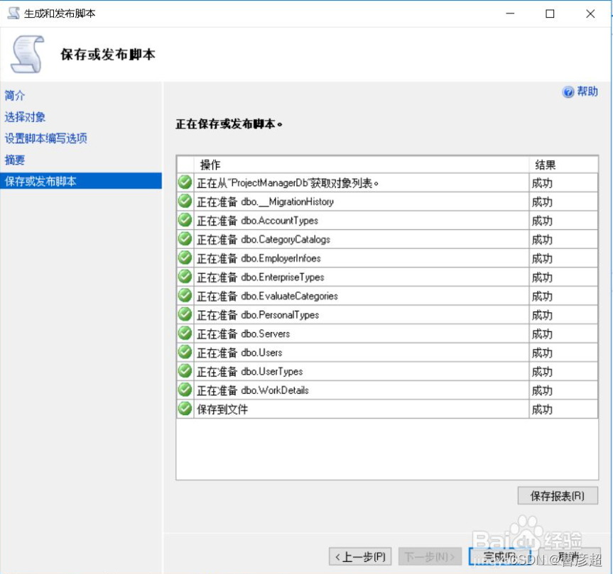

1.首先打开sql server，找到需要导出的数据库

2.单击右键，选择 任务  ->  生成脚本

3.选择下一步

4.等待一会加载后，选择具体数据库对象，然后选择需要的表，，之后继续点击下一步

5.点击高级选项

6.在打开的窗口中找到 要编写脚本的数据的类型 ，更改为 架构和数据，，之后点击确定

a、架构和数据(既有表又有数据)
b、仅限架构(表结构)
c、仅限数据(表数据)

7.选择输出的路径，选择好后，点击下一步

8.继续点击下一步

9.数据库中的表和数据就导出完毕了。

