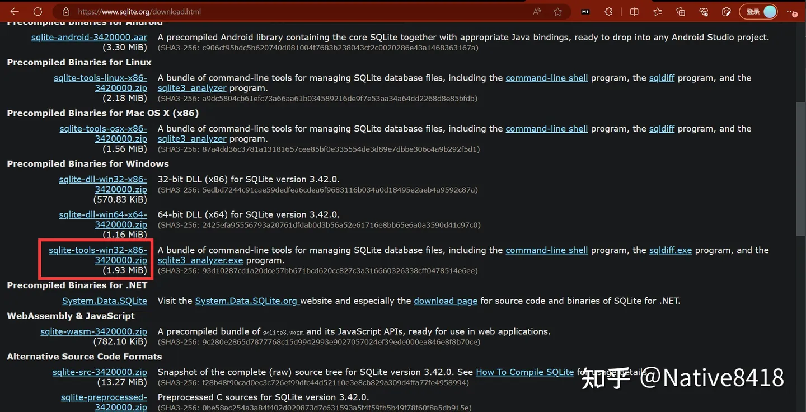
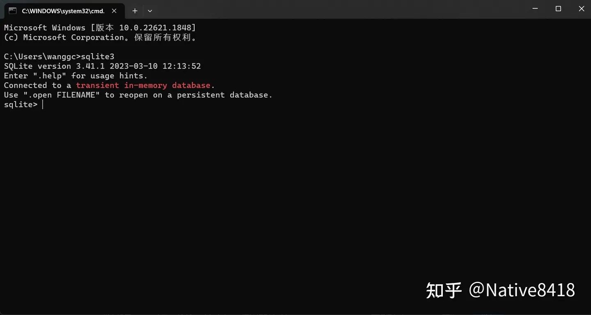

**简介**

SQLite 是一个开源的嵌入式关系数据库，实现了自给自足的、无服务器的、配置无需的、事务性的 SQL 数据库引擎。它是一个零配置的数据库，这意味着与其他数
据库系统不同，比如 MySQL、PostgreSQL 等，SQLite 不需要在系统中设置和管理一个单独的服务。这也使得 SQLite 是一种非常轻量级的数据库解决方案，
非常适合小型项目、嵌入式数据库或者测试环境中。

SQLite 的一些主要特性包括：

1、无服务器的：SQLite 不是一个单独的服务进程，而是直接嵌入到应用程序中。它直接读取和写入磁盘文件。

2、事务性的：SQLite 支持 ACID（原子性、一致性、隔离性、持久性）属性，能够确保所有事务都是安全、一致的，即使在系统崩溃或者电力中断的情况下。

3、零配置的：SQLite 不需要任何配置或者管理，这使得它非常容易安装和使用。

4、自包含的：SQLite 是一个自包含系统，这意味着它几乎不依赖其他任何外部系统或者库，这使得 SQLite 的跨平台移植非常方便。

5、小型的：SQLite 非常小巧轻量，全功能的 SQLite 数据库引擎的大小只有几百KB。

6、广泛应用：SQLite 被广泛应用在各种各样的产品和系统中，包括手机、平板电脑、嵌入式系统、物联网设备等。它也被广泛用于网站开发、科学研究、数据分析等
领域。

在一些轻量级的应用场景下，SQLite 是一个非常理想的选择，因为它简单、高效、易于使用和部署。然而，对于需要处理大量并发写操作或者需要更高级的功能（
如用户管理或者存储过程等）的应用场景，更全功能的数据库系统（如 PostgreSQL 或 MySQL）可能会是更好的选择。

**前置知识**

SQLite 是一个自包含的，无服务器的，零配置的，事务性的 SQL 数据库引擎。它是一个开源项目，你可以在各种编程语言中使用它，包括但不限于 Python、
Java、C# 等。

在开始学习 SQLite 之前，你可能需要了解以下技术或软件：

1、基础的 SQL 知识：SQLite 是一个基于 SQL 的数据库引擎，所以理解 SQL 的基本概念和语法（如 SELECT, INSERT, UPDATE, DELETE 等语句）对学习
SQLite 有很大的帮助。

2、数据库基础：理解基本的数据库概念，例如什么是数据库、表、行、列，以及主键、外键、索引等概念。

3、编程语言：尽管你可以直接通过命令行与 SQLite 交互，但通常我们会在编程语言中使用 SQLite。你应该对你选择的语言（如 Python、Java、C# 等）有
一些基础知识。

4、SQLite 客户端软件：虽然这不是必需的，但是有一个可视化的 SQLite 客户端软件可以使你更容易地查看和操作数据库。比如 SQLite Browser 或者 
DBeaver 等。

5、操作系统知识：SQLite 是一个文件数据库，对文件和目录的操作（如创建、删除、重命名等）会涉及到一些基本的操作系统知识。

6、版本控制系统：如果你打算在一个团队中使用 SQLite，你可能需要知道如何使用像 Git 这样的版本控制系统来管理和跟踪数据库文件的更改。

这些是学习 SQLite 的基本准备。当然，不同的学习资源可能有不同的先决条件，所以最好在开始一个新的学习资源之前检查其特定的先决条件。

**学习计划**

如果你已经具备了数据库相关知识和经验，那么在一小时内学习 SQLite 是完全可行的。以下是一个可能的学习路径：

1、SQLite 简介（10分钟）：首先，你需要理解 SQLite 是什么，以及它与其他数据库（如 MySQL 或 PostgreSQL）的主要区别。你可以阅读 SQLite 的官方文
档，了解 SQLite 的主要特性和使用场景。

2、安装 SQLite（5分钟）：SQLite 是一个自包含的程序，安装非常简单。如果你使用的是 Linux 或者 MacOS，那么 SQLite 很可能已经预装在你的系统中。
如果没有，你可以从 SQLite 的官方网站下载并安装。如果你使用的是 Windows，你可能需要下载一个预编译的二进制包。

3、使用 SQLite（15分钟）：打开一个终端，输入 sqlite3 命令，你就可以开始使用 SQLite 了。你可以尝试创建一个新的数据库，然后在数据库中创建表，插
入数据，查询数据等。这些操作都是通过 SQL 语言完成的，如果你已经熟悉 SQL，那么这一步应该非常简单。

4、项目实践（25分钟）：选择一个简单的项目进行实践，比如，你可以创建一个联系人管理系统，该系统有一个 contacts 表，包含 id、name 和 phone 三个
字段。你可以尝试实现添加联系人、删除联系人、查找联系人等功能。

5、总结（5分钟）：回顾你所学的内容，整理你在学习过程中遇到的问题和解决方案，思考你可以在什么场景下使用 SQLite。
这个计划假设你已经熟悉 SQL 语言，如果你还不熟悉 SQL，那么你可能需要花费更多的时间来学习 SQL 的基本语法和概念。

**SQLite 简介**

**SQLite 是什么，以及它与其他数据库（如 MySQL 或 PostgreSQL）的主要区别**

SQLite 是一个软件库，实现了自给自足的、无服务器的、零配置的、事务性的 SQL 数据库引擎。SQLite 是最广泛部署的 SQL 数据库引擎之一。SQLite 的
源代码在公共领域，任何人都可以免费使用和修改。

SQLite 与其他数据库（如 MySQL 或 PostgreSQL）的主要区别如下：

1、嵌入式：SQLite 是一个嵌入式数据库，这意味着它是一个库，不是一个独立的服务。在使用 SQLite 时，你的应用程序会直接与数据库文件进行交互，而不是
通过网络与运行在另一个进程或机器上的数据库服务器进行交互。这使得 SQLite 在需要轻量级本地存储的场景中非常有用，例如在移动应用、桌面应用或物联网
设备中。

2、无服务器：与其他数据库不同，SQLite 不需要运行数据库服务器。SQLite 数据库只是一个文件，你可以直接在你的文件系统中创建和操作它。这使得 SQLite
在设置和维护方面非常简单。

3、轻量级：SQLite 是一个非常小的库，其完全配置下的二进制文件大小在 1MB 左右，这使得它在资源受限的环境中非常有用。

4、事务性：像其他的 SQL 数据库一样，SQLite 支持事务，这意味着你可以组合多个操作作为一个单一的、原子的操作。

5、零配置：SQLite 不需要任何配置，这使得它在需要快速简单存储解决方案的场景中非常有用。

需要注意的是，虽然 SQLite 非常适合某些应用场景，但它并不适合所有场景。例如，如果你需要处理大量并发写入，或者需要更复杂的查询和性能优化，那么你可
能需要考虑使用更强大的数据库系统，如 MySQL 或 PostgreSQL。

**SQLite 的使用场景**
SQLite 的这些特性使其成为很多场景的理想选择，包括：

1、嵌入式设备和物联网：由于 SQLite 的轻量级和无服务器特性，使其成为嵌入式设备和物联网设备的理想选择。

2、客户端存储：SQLite 非常适合存储客户端应用程序数据，包括桌面应用程序和移动应用程序。

3、开发和测试：SQLite 由于其零配置和易于集成的特性，常常被用于软件开发和测试环境。

4、单用户桌面应用：对于需要本地存储的桌面应用，SQLite 是一个很好的选择，例如电子邮件客户端、数据分析工具等。

5、服务器端缓存和数据处理：在服务器端，SQLite 可以用作缓存服务器，或者进行数据处理和转换。

需要注意的是，虽然 SQLite 非常方便和高效，但并不适合所有的应用场景。例如，它不适合处理大量的并发写入，或者需要多用户共享和写入的场景，这时候就需
要使用其他的数据库系统，如 PostgreSQL、MySQL 或者 Oracle 等。

**安装 SQLite**
要在 Windows 上安装 SQLite，您可以按照以下步骤进行：

**下载 SQLite：** 

首先，您需要从 SQLite 的官方网站下载 SQLite。您可以在以下链接中找到它： https://www.sqlite.org/download.html
在下载页面中，您需要在 "Precompiled Binaries for Windows" 部分下载适合您的 Windows 系统的版本（32 位或 64 位）。对于大多数用户来说，
"sqlite-tools-win32-x86-xxxx.zip" 是一个好的选择。

**解压 SQLite：**

下载完.zip 文件后，找到这个文件并解压它。您可以将它解压到任何您喜欢的目录，比如 C:\sqlite。

**配置环境变量：**

为了在命令提示符或 PowerShell 中从任何地方运行 SQLite，您需要将 SQLite 的路径添加到您的 PATH 环境变量中。

打开控制面板并选择 "系统"。
点击 "高级系统设置"。
在 "系统属性" 对话框中，点击 "环境变量" 按钮。
在 "系统变量" 部分，滚动找到并选中 "Path"，然后点击 "编辑"。
在 "编辑环境变量" 对话框中，点击 "新建"，然后输入您的 SQLite 目录的路径，比如 C:\sqlite。
点击 "确定" 保存更改。

**测试安装：**

打开一个新的命令提示符或 PowerShell 窗口，并输入 sqlite3。如果您看到了 SQLite 的欢迎消息和一个命令提示符，那么说明您已经成功安装了 SQLite。

请注意，上述步骤可能会因您的 Windows 版本和系统设置的不同而略有不同。如果您在安装过程中遇到任何问题，我建议您查阅 SQLite 的官方文档或寻求专
业的技术支持。

**基本使用**

当你已经安装了SQLite并将其添加到了环境变量中，你就可以在终端（命令行）中输入 sqlite3 来启动SQLite的命令行界面。以下是一些基本操作：

1、创建一个新的数据库：

你可以使用 .open 命令来创建一个新的数据库。例如，.open newDatabase.db 将会创建一个名为 newDatabase.db 的新数据库。
如果这个文件已经存在，那么SQLite将会打开这个数据库；否则，它将会创建一个新的数据库。

2、在数据库中创建表：

你可以使用 CREATE TABLE SQL语句来创建一个新的表。例如，CREATE TABLE Students (ID INT PRIMARY KEY NOT NULL, Name 
TEXT NOT NULL, Age INT NOT NULL, Address CHAR(50)); 将会创建一个名为 Students 的新表，这个表有四个字段：ID，Name，Age和Address。

3、插入数据：

你可以使用 INSERT INTO SQL语句来向表中插入数据。例如，INSERT INTO Students (ID, Name, Age, Address) VALUES (1, 'Tom',
20, 'New York'); 将会向 Students 表中插入一条新的数据。

4、查询数据：

你可以使用 SELECT SQL语句来查询数据。例如，SELECT * FROM Students; 将会选择 Students 表中的所有数据。

5、更新数据：

你可以使用 UPDATE SQL语句来更新数据。例如，UPDATE Students SET Address = 'San Francisco' WHERE ID = 1; 将会将ID为1的学生
的地址更新为 'San Francisco'。

6、删除数据：

你可以使用 DELETE SQL语句来删除数据。例如，DELETE FROM Students WHERE ID = 1; 将会删除ID为1的学生的数据。
在你完成所有操作后，你可以使用 .quit 命令来退出SQLite命令行界面。

如果你已经熟悉SQL语言，这些操作应该很直观。如果你对SQL不熟悉，你可能需要查阅一些关于SQL的教程或者文档。

运行效果

E:\Code_Low_Complexity\AnHourStudy\SQLiteAnHour>sqlite3
SQLite version 3.41.1 2023-03-10 12:13:52
Enter ".help" for usage hints.
Connected to a transient in-memory database.
Use ".open FILENAME" to reopen on a persistent database.
sqlite> .open newDatabase.db
sqlite> CREATE TABLE Students (ID INT PRIMARY KEY NOT NULL, Name TEXT NOT NULL, Age INT NOT NULL, Address CHAR(50));
sqlite> INSERT INTO Students (ID, Name, Age, Address) VALUES (1, 'Tom', 20, 'New York');
sqlite> SELECT * FROM Students;
1|Tom|20|New York
sqlite> UPDATE Students SET Address = 'San Francisco' WHERE ID = 1;
sqlite> SELECT * FROM Students;
1|Tom|20|San Francisco
sqlite> DELETE FROM Students WHERE ID = 1;
sqlite> SELECT * FROM Students;
sqlite> .quit

E:\Code_Low_Complexity\AnHourStudy\SQLiteAnHour>

**项目实践**

这个实践项目是创建一个简单的联系人管理系统，该系统有一个 contacts 表，包含 id、name 和 phone 三个字段。以下是具体的操作步骤：

1、创建表：首先，你需要在数据库中创建一个名为 contacts 的表，这个表有三个字段，分别是 id（整型），name（文本型）和 phone（文本型）。在SQLite命令行中，你可以输入以下SQL语句来创建这个表：

CREATE TABLE contacts (id INTEGER PRIMARY KEY, name TEXT, phone TEXT);
这个SQL语句定义了一个新的表 contacts，这个表有三个字段：id，name 和 phone。id 字段是主键。

2、添加联系人：接着，你可以向 contacts 表中添加一些联系人。例如，要添加一个名为 "John Doe"，电话号码为 "1234567890" 的联系人，你可以输入以下SQL语句：

INSERT INTO contacts (name, phone) VALUES ('John Doe', '1234567890');
注意，因为 id 字段是主键，所以SQLite会自动为每一个新的联系人分配一个唯一的 id。

3、查找联系人：你可以使用 SELECT SQL语句来查找联系人。例如，要查找所有联系人的信息，你可以输入以下SQL语句：

SELECT * FROM contacts;
要查找特定的联系人，你可以添加一个 WHERE 子句。例如，要查找名为 "John Doe" 的联系人，你可以输入以下SQL语句：

SELECT * FROM contacts WHERE name = 'John Doe';

4、删除联系人：你可以使用 DELETE SQL语句来删除联系人。例如，要删除名为 "John Doe" 的联系人，你可以输入以下SQL语句：

DELETE FROM contacts WHERE name = 'John Doe';
这就是一个简单的联系人管理系统的基本操作。你可以根据实际需要，添加更多的功能，例如，更新联系人信息、按电话号码查找联系人等等。

运行结果

E:\Code_Low_Complexity\AnHourStudy\SQLiteAnHour>sqlite3
SQLite version 3.41.1 2023-03-10 12:13:52
Enter ".help" for usage hints.
Connected to a transient in-memory database.
Use ".open FILENAME" to reopen on a persistent database.
sqlite> .open newDatabase.db
sqlite> CREATE TABLE contacts (id INTEGER PRIMARY KEY, name TEXT, phone TEXT);
sqlite> INSERT INTO contacts (name, phone) VALUES ('John Doe', '1234567890');
sqlite> SELECT * FROM contacts;
1|John Doe|1234567890
sqlite> SELECT * FROM contacts WHERE name = 'John Doe';
1|John Doe|1234567890
sqlite> DELETE FROM contacts WHERE name = 'John Doe';
sqlite> SELECT * FROM contacts;
sqlite> .quit

E:\Code_Low_Complexity\AnHourStudy\SQLiteAnHour>