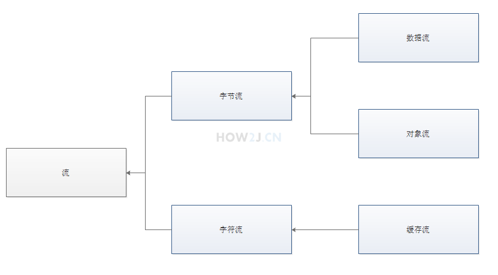

流关系图

一、创建文件对象

    package file;
      
    import java.io.File;
  
    public class TestFile {
  
        public static void main(String[] args) {
            // 绝对路径
            File f1 = new File("d:/LOLFolder");
            System.out.println("f1的绝对路径：" + f1.getAbsolutePath());
            // 相对路径,相对于工作目录，如果在eclipse中，就是项目目录
            File f2 = new File("LOL.exe");
            System.out.println("f2的绝对路径：" + f2.getAbsolutePath());
      
            // 把f1作为父目录创建文件对象
            File f3 = new File(f1, "LOL.exe");
      
            System.out.println("f3的绝对路径：" + f3.getAbsolutePath());
        }
    }

二、文件常用方法1

需要在D:\LOLFolder确实存在一个LOL.exe,才可以看到对应的文件长度、修改时间等信息

    package file;
      
    import java.io.File;
    import java.util.Date;
      
    public class TestFile {
  
        public static void main(String[] args) {
      
            File f = new File("d:/LOLFolder/LOL.exe");
            System.out.println("当前文件是：" +f);
            //文件是否存在
            System.out.println("判断是否存在："+f.exists());
             
            //是否是文件夹
            System.out.println("判断是否是文件夹："+f.isDirectory());
              
            //是否是文件（非文件夹）
            System.out.println("判断是否是文件："+f.isFile());
              
            //文件长度
            System.out.println("获取文件的长度："+f.length());
              
            //文件最后修改时间
            long time = f.lastModified();
            Date d = new Date(time);
            System.out.println("获取文件的最后修改时间："+d);
            //设置文件修改时间为1970.1.1 08:00:00
            f.setLastModified(0);
              
            //文件重命名
            File f2 =new File("d:/LOLFolder/DOTA.exe");
            f.renameTo(f2);
            System.out.println("把LOL.exe改名成了DOTA.exe");
             
            System.out.println("注意： 需要在D:\\LOLFolder确实存在一个LOL.exe,\r\n才可以看到对应的文件长度、修改时间等信息");
        }
    }
 
三、文件常用方法2

    package file;
      
    import java.io.File;
    import java.io.IOException;
      
    public class TestFile {
      
        public static void main(String[] args) throws IOException {
      
            File f = new File("d:/LOLFolder/skin/garen.ski");
      
            // 以字符串数组的形式，返回当前文件夹下的所有文件（不包含子文件及子文件夹）
            f.list();
      
            // 以文件数组的形式，返回当前文件夹下的所有文件（不包含子文件及子文件夹）
            File[]fs= f.listFiles();
      
            // 以字符串形式返回获取所在文件夹
            f.getParent();
      
            // 以文件形式返回获取所在文件夹
            f.getParentFile();

            // 创建文件夹，如果父文件夹skin不存在，创建就无效
            f.mkdir();
      
            // 创建文件夹，如果父文件夹skin不存在，就会创建父文件夹
            f.mkdirs();
      
            // 创建一个空文件,如果父文件夹skin不存在，就会抛出异常
            f.createNewFile();

            // 所以创建一个空文件之前，通常都会创建父目录
            f.getParentFile().mkdirs();
      
            // 列出所有的盘符c: d: e: 等等
            f.listRoots();
      
            // 刪除文件
            f.delete();
      
            // JVM结束的时候，刪除文件，常用于临时文件的删除
            f.deleteOnExit();
      
        }
    }

四、遍历文件夹
一般说来操作系统都会安装在C盘，所以会有一个 C:\WINDOWS目录。
遍历这个目录下所有的文件(不用遍历子目录)
找出这些文件里，最大的和最小(非0)的那个文件，打印出他们的文件名：

    package file;
       
    import java.io.File;
       
    public class TestFile {
   
        public static void main(String[] args) {
            File f = new File("c:\\windows");
            File[] fs = f.listFiles();
            if(null==fs)
                return;
            long minSize = Integer.MAX_VALUE;
            long maxSize = 0;
            File minFile = null;
            File maxFile = null;
            for (File file : fs) {
                if(file.isDirectory())
                    continue;
                if(file.length()>maxSize){
                    maxSize = file.length();
                    maxFile = file;
                }
                if(file.length()!=0 && file.length()<minSize){
                    minSize = file.length();
                    minFile = file;
                }
            }
            System.out.printf("最大的文件是%s，其大小是%,d字节%n",maxFile.getAbsoluteFile(),maxFile.length());
            System.out.printf("最小的文件是%s，其大小是%,d字节%n",minFile.getAbsoluteFile(),minFile.length());
        }
    }

五、遍历子文件夹

使用递归来进行文件夹的遍历

    package file;
       
    import java.io.File;
       
    public class TestFile {
      
        static long minSize = Integer.MAX_VALUE;
        static long maxSize = 0;
        static File minFile = null;
        static File maxFile = null;
      
        //使用递归来遍历一个文件夹的子文件
        public static void listFiles(File file){
            if(file.isFile()){
                if(file.length()>maxSize){
                    maxSize = file.length();
                    maxFile = file;
                }
                if(file.length()!=0 && file.length()<minSize){
                    minSize = file.length();
                    minFile = file;
                }
                return;
            }
              
            if(file.isDirectory()){
                File[] fs = file.listFiles();
                if(null!=fs)
                for (File f : fs) {
                    listFiles(f);
                }
            }
        }
       
        public static void main(String[] args) {
            File f = new File("c:\\windows");
            listFiles(f);
            System.out.printf("最大的文件是%s，其大小是%,d字节%n",maxFile.getAbsoluteFile(),maxFile.length());
            System.out.printf("最小的文件是%s，其大小是%,d字节%n",minFile.getAbsoluteFile(),minFile.length());
       
        }
    }