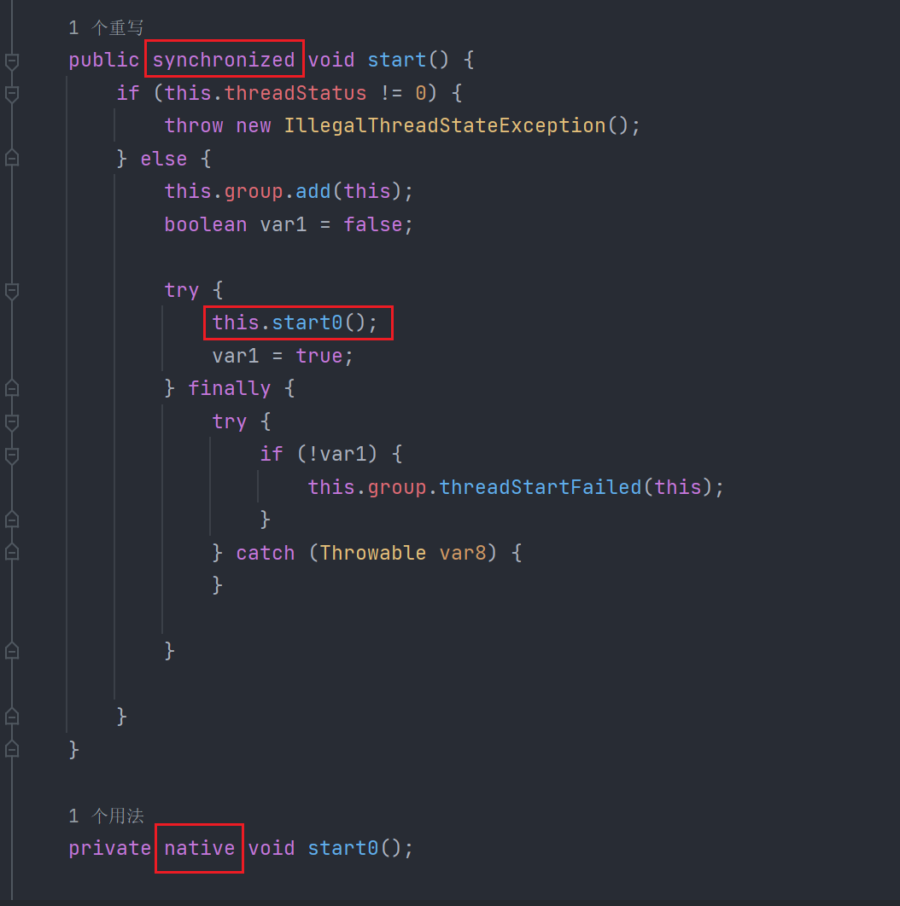

1 JUC是什么

    juc指 java.util.concurrent包

2 线程与进程

    进程：一个程序的集合，一个进程可以包含多个线程（至少是包含一个）
    线程：是执行程序的一次执行过程，它是一个动态的概念。是系统资源分配的单位

3 Java启动线程的三种方式

    a、继承Thread类
    b、实现Runnable接口
    c、实现callable接口

    （为什么说Java 无法开启一条线程）

    方法加了同步锁，把当前线程加入线程组后调用了start0()方法，start0()为本地方法，是属于底层的C++ ，所以说Java 无法直接操作硬件生成线程。