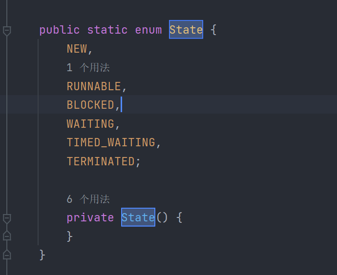

1 JUC是什么

    juc指 java.util.concurrent包

2 线程与进程

    进程：一个程序的集合，一个进程可以包含多个线程（至少是包含一个）
    线程：是执行程序的一次执行过程，它是一个动态的概念。是系统资源分配的单位(java 默认有两个线程，至少包含一个。main、GC)

    

3 Java启动线程的三种方式

    a、继承Thread类
    b、实现Runnable接口
    c、实现callable接口

    （为什么说Java 无法开启一条线程）

    方法加了同步锁，把当前线程加入线程组后调用了start0()方法，start0()为本地方法，是属于底层的C++ ，所以说Java 无法直接操作硬件生成线程。

4 并发和并行

    a、并发：CPU一核情况下，模拟出来多条线程

    b、并行：CPU多核，多个线程可以同时执行（线程池）

并发编程的本质：**充分利用CPU的资源**

5 线程有几个状态

    
    a、新生        NEW
    b、运行        RUNNABLE
    c、阻塞        BLOCKED
    d、等待        WAITING
    e、超时等待    TIMED_WAITING 
    f、终止        TERMINATED

6 wait和sleep的区别

    // 业务代码中需要休眠
    TimeUnit.DAYS.sleep(1);    // 休眠1天
    TimeUnit.SECINDS.sleep(2); // 休眠2分钟

    a、来自不同的类 
        wait  来自 Object类
        sleep 来自 Thread接口
    b、关于锁的释放
        wait    会释放锁
        sleep   不会释放锁
    c、使用的范围是不同的
        wait    必须在同步代码块中
        sleep   可以在任何地方睡

