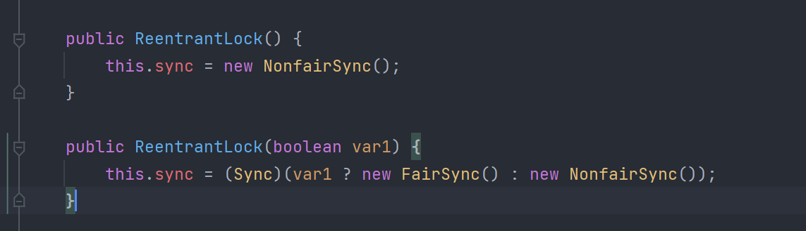

1 公平锁和非公平锁

    Lock lock = new ReentrantLock();
    lock.lock();        //加锁
    lock.tryLock();     //
    lock.unlock();      //解锁

    
    //非公平锁

    public ReentrantLock() {
        this.sync = new NonfairSync();
    }

    // 公平锁（默认）

    public ReentrantLock(boolean var1) {
        this.sync = (Sync)(var1 ? new FairSync() : new NonfairSync());
    }

2 Synchronized 和 Lock 区别

    a、Synchronized 是内置的java关键字，Lock是一个java类
    b、Synchronized 无法判断获取锁的状态，Lock是可以判断是否获取了锁
    c、Synchronized 会自动释放锁，Locak必须要手动释放锁！如果不释放锁，会导致死锁
    d、Synchronized 线程1（获得锁，阻塞）、线程2（等待，一直等）；Lock锁就不一定会等待下去
    e、Synchronized 可重入锁，不可以中断的，非公平;Lock,可重入锁，可以判断锁，非公平（可以自己设置）；
    f、Synchronized 适合少量的代码同步问题，Lock适合锁大量的同步代码

3  生产者和消费者问题
    单例模式、排序算法、生产者和消费者问题、死锁问题    

    a、Synchronized版

    b、JUC版
    
    

