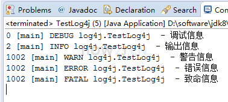
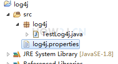
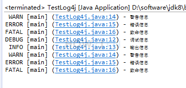

一、导入jar包

二 、使用Log4j

我们使用Log4j来进行日志输出。 采用如下代码，可以看到输出结果：

1. 知道是log4j.TestLog4j这个类里的日志
2. 是在[main]线程里的日志
3. 日志级别可观察，一共有6个级别 TRACE DEBUG INFO WARN ERROR FATAL
4. 日志输出级别范围可控制， 如代码所示，只输出高于DEBUG级别的，那么TRACE级别的日志自动不输出
5. 每句日志消耗的毫秒数(最前面的数字)，可观察，这样就可以进行性能计算

       package log4j;
       import org.apache.log4j.BasicConfigurator;
       import org.apache.log4j.Level;
       import org.apache.log4j.Logger;

       public class TestLog4j {
       static Logger logger = Logger.getLogger(TestLog4j.class);
           public static void main(String[] args) throws InterruptedException {
               BasicConfigurator.configure();
               logger.setLevel(Level.DEBUG);
               logger.trace("跟踪信息");
               logger.debug("调试信息");
               logger.info("输出信息");
               Thread.sleep(1000);
               logger.warn("警告信息");
               logger.error("错误信息");
               logger.fatal("致命信息");
           }
       }

输出结果：

三、代码讲解

1、 基于类的名称获取日志对象

    static Logger logger = Logger.getLogger(TestLog4j.class);

2、进行默认配置

    BasicConfigurator.configure();

3、设置日志输出级别

    logger.setLevel(Level.DEBUG);

4、进行不同级别的日志输出

    logger.trace("跟踪信息");
    logger.debug("调试信息");
    logger.info("输出信息");
    Thread.sleep(1000);
    logger.warn("警告信息");
    logger.error("错误信息");
    logger.fatal("致命信息");

Thread.sleep(1000); 是为了便于观察前后日志输出的时间差

四、Log4j配置讲解（properties）

1、新增配置文件log4j.properties

    log4j.rootLogger=debug, stdout, R
    
    log4j.appender.stdout=org.apache.log4j.ConsoleAppender
    log4j.appender.stdout.layout=org.apache.log4j.PatternLayout
    
    # Pattern to output the caller's file name and line number.
    log4j.appender.stdout.layout.ConversionPattern=%5p [%t] (%F:%L) - %m%n
    
    log4j.appender.R=org.apache.log4j.RollingFileAppender
    log4j.appender.R.File=example.log
    
    log4j.appender.R.MaxFileSize=100KB
    # Keep one backup file
    log4j.appender.R.MaxBackupIndex=5
    
    log4j.appender.R.layout=org.apache.log4j.PatternLayout
    log4j.appender.R.layout.ConversionPattern=%p %t %c - %m%n

2、然后修改TestLog4j，并运行。

    import org.apache.log4j.Logger;
    import org.apache.log4j.PropertyConfigurator;
    
    public class TestLog4j {
        static Logger logger = Logger.getLogger(TestLog4j.class);
        public static void main(String[] args) throws InterruptedException {
            PropertyConfigurator.configure("e:\\project\\log4j\\src\\log4j.properties");
            for (int i = 0; i < 5000; i++) {
                logger.trace("跟踪信息");
                logger.debug("调试信息");
                logger.info("输出信息");
                logger.warn("警告信息");
                logger.error("错误信息");
                logger.fatal("致命信息");
            }
        }
    }

有两个效果

* 输出在控制台，并且格式有所变化，如图所示，会显示是哪个类的哪一行输出的信息
* 不仅仅在控制台有输出，在把日志输出到了 E:\project\log4j\example.log 这个位置

3、分析代码

与 Log4j入门 中的BasicConfigurator.configure();方式不同，采用指定配置文件

    PropertyConfigurator.configure("e:\\project\\log4j\\src\\log4j.properties");

Log4j的配置方式按照log4j.properties中的设置进行

4、解释log4j.properties

    log4j.rootLogger=debug, stdout, R
    
    log4j.appender.stdout=org.apache.log4j.ConsoleAppender
    log4j.appender.stdout.layout=org.apache.log4j.PatternLayout
    
    # Pattern to output the caller's file name and line number.
    log4j.appender.stdout.layout.ConversionPattern=%5p [%t] (%F:%L) - %m%n
    
    log4j.appender.R=org.apache.log4j.RollingFileAppender
    log4j.appender.R.File=example.log
    log4j.appender.R.MaxFileSize=100KB
    log4j.appender.R.MaxBackupIndex=5
    
    log4j.appender.R.layout=org.apache.log4j.PatternLayout
    log4j.appender.R.layout.ConversionPattern=%p %t %c - %m%n

设置日志输出的等级为debug,低于debug就不会输出了
设置日志输出到两种地方，分别叫做 stdout和 R

    log4j.rootLogger=debug, stdout, R

第一个地方stdout, 输出到控制台

    log4j.appender.stdout=org.apache.log4j.ConsoleAppender

输出格式是 %5p [%t] (%F:%L) - %m%n, 格式解释在下个步骤讲解

    log4j.appender.stdout.layout=org.apache.log4j.PatternLayout
    log4j.appender.stdout.layout.ConversionPattern=%5p [%t] (%F:%L) - %m%n

第二个地方R, 以滚动的方式输出到文件，文件名是example.log,文件最大100k, 最多滚动5个文件

    log4j.appender.R=org.apache.log4j.RollingFileAppender
    log4j.appender.R.File=example.log
    log4j.appender.R.MaxFileSize=100KB
    log4j.appender.R.MaxBackupIndex=5

输出格式是 %p %t %c - %m%n, 格式解释在下个步骤讲解

    log4j.appender.R.layout=org.apache.log4j.PatternLayout
    log4j.appender.R.layout.ConversionPattern=%p %t %c - %m%n

5、格式解释

    log4j日志输出格式一览：
    %c 输出日志信息所属的类的全名
    %d 输出日志时间点的日期或时间，默认格式为ISO8601，也可以在其后指定格式，比如：%d{yyy-MM-dd HH:mm:ss }，输出类似：2002-10-18- 22：10：28
    %f 输出日志信息所属的类的类名
    %l 输出日志事件的发生位置，即输出日志信息的语句处于它所在的类的第几行
    %m 输出代码中指定的信息，如log(message)中的message
    %n 输出一个回车换行符，Windows平台为“rn”，Unix平台为“n”
    %p 输出优先级，即DEBUG，INFO，WARN，ERROR，FATAL。如果是调用debug()输出的，则为DEBUG，依此类推
    %r 输出自应用启动到输出该日志信息所耗费的毫秒数
    %t 输出产生该日志事件的线程名
    
    所以：
    %5p [%t] (%F:%L) - %m%n 就表示
    宽度是5的优先等级 线程名称 (文件名:行号) - 信息 回车换行

四、Log4j配置讲解（xml）

除了使用log4j.properties，也可以使用xml格式进行配置。
在src目录下装备log4j.xml文件

    <?xml version="1.0" encoding="UTF-8" ?>
    <!DOCTYPE log4j:configuration PUBLIC "-//log4j/log4j Configuration//EN" "log4j.dtd">
    
    <log4j:configuration xmlns:log4j="http://jakarta.apache.org/log4j/">
    
        <appender name="STDOUT" class="org.apache.log4j.ConsoleAppender">
           <layout class="org.apache.log4j.PatternLayout">
              <param name="ConversionPattern" value="%d %-5p %c.%M:%L - %m%n"/>
           </layout>
        </appender>
       
        <!-- specify the logging level for loggers from other libraries -->
        <logger name="com.opensymphony">
            <level value="ERROR" />
        </logger>
      
        <logger name="org.apache">
             <level value="ERROR" />
        </logger>
        <logger name="org.hibernate">
             <level value="ERROR" />
        </logger>
    
       <!-- for all other loggers log only debug and above log messages -->
         <root>
            <priority value="ERROR"/>
            <appender-ref ref="STDOUT" />
         </root>
    
    </log4j:configuration>

使用log4j.xml作为配置文件，并运行

    import org.apache.log4j.Logger;
    import org.apache.log4j.PropertyConfigurator;
    
    public class TestLog4j {
        static Logger logger = Logger.getLogger(TestLog4j.class);
        public static void main(String[] args) throws InterruptedException {
            PropertyConfigurator.configure("e:\\project\\log4j\\src\\log4j.xml");
                for (int i = 0; i < 5000; i++) {
                    logger.trace("跟踪信息");
                    logger.debug("调试信息");
                    logger.info("输出信息");
                    logger.warn("警告信息");
                    logger.error("错误信息");
                    logger.fatal("致命信息");
                }
        }
    }