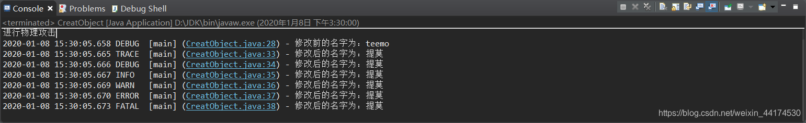
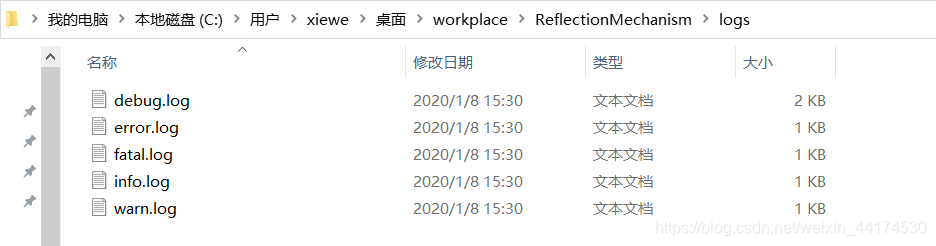

准备:

    Log42j的官网下载地址：Log4j2官网 https://logging.apache.org/log4j/2.x/download.html

第一步

1. 解压:apache-log4j-2.13.0-bin.zip；
2. 把其中的 log4j-api-2.13.0.jar 和 log4j-core-2.13.0.jar 两个jar包置于项目的根目录下，为了方便起见，建议在根目录下新建 lib 文件夹，把两个jar包放在里面；
3. 导进jar包：右键项目 -> properties -> Java Build Path -> Add External JARS
   
第二步

6. 在src类目录下新建一个配置文件：右键src -> New -> Other -> General -> File
   文件名一定要是：log4j2.xml 否则会找不到相关配置路径，到时候打印日志就只能使用内置的配置形式了；
7. 接下来是重点，主要讲解配置文件log4j2.xml

   最终配置代码如下,附上了详细的注释，要了解请仔细看：

    
        <?xml version="1.0" encoding="UTF-8"?>
        <!-- 对配置状态进行关闭，不把打印的细节在控制台中输出 -->
        <!-- 该配置状态分为8个级别：高->低：OFF、FATAL、ERROR、WARN、INFO、DEBUG、TRACE、ALL -->
        <Configuration status="OFF">
        
          <Appenders>
            <!-- 在控制台打印日志 -->
            <Console name="Console" target="SYSTEM_OUT">
              <PatternLayout pattern="%d{yyy-MM-dd HH:mm:ss.SSS} %-6level [%t] (%F:%L) - %msg%n"/>
            </Console>
    
        <!-- 日志输出分为6个级别：高->低：FATAL、ERROR、WARN、INFO、DEBUG、TRACE -->
        <!-- Debug调试级别 -->
        <!-- 这里根据你的个人习惯来写就好了，不细分的话写一个File就好了 -->
        <!-- 输出日志文件,位置自动保存在项目根目录下的logs文件夹中 -->
        <File name="MyDebugFile" fileName="logs/debug.log">
        <!-- 我这么写是为了把不同级别的日志筛选开来，便于查看 -->
        <!-- Filter过滤器，以此设置日志级别，进行不同程度的日志区分，如果不这样细分，可把Filter去掉 -->
        <!-- 比如这样设置：<ThresholdFilter level="debug" onMatch="ACCEPT" onMismatch="DENY"/>  -->
        <Filters> 
        <!-- 第一步 onMatch="DENY"：匹配到info及更高级别就DENY过滤掉，其他的NEUTRAL保留 -->
        <ThresholdFilter level="info" onMatch="DENY" onMismatch="NEUTRAL"/> 
        <!-- 第二步 onMatch="ACCEPT"：匹配到debug及更高级别就ACCEPT保留，其他的DENY过滤掉 -->
        <!-- 经过两步过滤，把debug以上的和以下的级别全部过滤，最终剩下debug级别 -->
        <ThresholdFilter level="debug" onMatch="ACCEPT" onMismatch="DENY"/> 
        </Filters>
          <!-- 对打印语句的格式进行设置，这个太多放在后面讲 -->
          <PatternLayout pattern="%d{yyy-MM-dd HH:mm:ss.SSS} %-6level [%t] (%F:%L) - %msg%n"/>     
        </File>
        
        <!-- Info信息级别 -->
        <File name="MyInfoFile" fileName="logs/info.log">
        <Filters> 
        <ThresholdFilter level="warn" onMatch="DENY" onMismatch="NEUTRAL"/> 
        <ThresholdFilter level="info" onMatch="ACCEPT" onMismatch="DENY"/> 
        </Filters>
          <PatternLayout pattern="%d{yyy-MM-dd HH:mm:ss.SSS} %-6level [%t] (%F:%L) - %msg%n"/>     
        </File>
    
        <!-- Warn警告级别 -->
        <File name="MyWarnFile" fileName="logs/warn.log">
        <Filters> 
        <ThresholdFilter level="error" onMatch="DENY" onMismatch="NEUTRAL"/> 
        <ThresholdFilter level="warn" onMatch="ACCEPT" onMismatch="DENY"/> 
        </Filters>
          <PatternLayout pattern="%d{yyy-MM-dd HH:mm:ss.SSS} %-6level [%t] (%F:%L) - %msg%n"/>     
        </File>
    
        <!-- Error错误级别 -->
        <File name="MyErrorFile" fileName="logs/error.log">
        <Filters> 
        <ThresholdFilter level="fatal" onMatch="DENY" onMismatch="NEUTRAL"/> 
        <ThresholdFilter level="error" onMatch="ACCEPT" onMismatch="DENY"/> 
        </Filters>
          <PatternLayout pattern="%d{yyy-MM-dd HH:mm:ss.SSS} %-6level [%t] (%F:%L) - %msg%n"/>     
        </File>
    
        <!-- Fatal严重错误级别 -->
        <File name="MyFatalFile" fileName="logs/fatal.log">
        <ThresholdFilter level="fatal" onMatch="ACCEPT" onMismatch="DENY"/> 
          <PatternLayout pattern="%d{yyy-MM-dd HH:mm:ss.SSS} %-6level [%t] (%F:%L) - %msg%n"/>     
        </File>
      </Appenders>
    
      <!-- 定义Loggers，只有定义了Loggers并引入刚才的appender配置，配置才会生效 --> 
      <Loggers>
        <Root level="trace">
          <!-- Only events at DIAG level or more specific are sent to the console. -->
          <AppenderRef ref="Console"/>
          <AppenderRef ref="MyDebugFile"/>
          <AppenderRef ref="MyInfoFile"/>
          <AppenderRef ref="MyWarnFile"/>
          <AppenderRef ref="MyErrorFile"/>
          <AppenderRef ref="MyFatalFile"/>
        </Root>
      </Loggers>
    </Configuration>

日志输出格式设置：%d{yyy-MM-dd HH:mm:ss.SSS} %-6level [%t] (%F:%L) - %msg%n"
格式一览表:

    %d: 输出日志发生时间，可进行格式{yyy-MM-dd HH:mm:ss.SSS}设置，也可不用
    %-6level: 输出的级别信息右对齐，总长度为6字符；正数为左对齐，看个人习惯
    %t: 输出产生该日志事件的线程名
    %F: 输出日志信息所属的类的类名
    %l: 输出日志事件的发生位置，即输出日志信息的语句处于它所在的类的第几行
    %msg: 输出日志信息
    %n: 换行
    %c: 输出日志信息所属的类的全名
    %c: 输出自应用启动到输出该日志信息所耗费的毫秒数

第三步

进行打印测试.............

    import org.apache.logging.log4j.LogManager;
    import org.apache.logging.log4j.Logger;
    
    public class Hero{
        String name;
        private static Logger logger = LogManager.getLogger(Hero.class.getName());
        public static void main(String[] args){
                Hero teemo = new Hero();
                teemo.name = "teemo";		
                logger.debug("修改前的名字为：" + teemo.name);  
                teemo.name="提莫";
                logger.trace("修改后的名字为：" + teemo.name); 
                logger.debug("修改后的名字为：" + teemo.name); 
                logger.info("修改后的名字为：" + teemo.name); 
                logger.warn("修改后的名字为：" + teemo.name); 
                logger.error("修改后的名字为：" + teemo.name); 
                logger.fatal("修改后的名字为：" + teemo.name);
            
        }
    }

控制台输出如下：

输出的日志文件：

