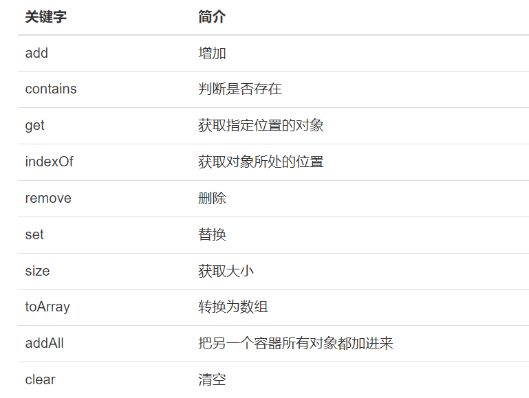

一、与数组的区别

1、使用数组的局限性

如果要存放多个对象，可以使用数组，但是数组有局限性

比如 声明长度是10的数组

不用的数组就浪费了；超过10的个数，又放不下

为了解决数组的局限性，引入容器类的概念。 最常见的容器类就是 ArrayList

容器的容量"capacity"会随着对象的增加，自动增长

只需要不断往容器里增加英雄即可，不用担心会出现数组的边界问题。

2、ArrayList的常用方法

其中方法contains 判断一个对象是否在容器中，判断的是“是否是同一个对象”，并不是判断是否有相同的值！！！

3、将ArrayList转换为数组

toArray可以把一个ArrayList对象转换为数组。

需要注意的是，如果要转换为一个Hero数组，那么需要传递一个Hero数组类型的对象给toArray()，这样toArray方法才知道，你希望转换为哪种类型的数组，否则只能转换为Object数组

public class TestCollection {
public static void main(String[] args) {
ArrayList heros = new ArrayList();

        // 初始化5个对象      
       public class TestCollection {
            public static void main(String[] args) {
            ArrayList heros = new ArrayList();
        for (int i = 0; i < 5; i++) {
            heros.add(new Hero("hero " + i));
        }
        Hero specialHero = new Hero("special hero");
        heros.add(specialHero);
        System.out.println(heros);
        Hero hs[] = (Hero[])heros.toArray(new Hero[]{});
        System.out.println("数组:" +hs);
    }
  
4、List接口

ArrayList实现了接口List

常见的写法会把引用声明为接口List类型

5、 遍历ARRAYLIST的两种方法

    A、用for循环遍历
    public class TestCollection {
    public static void main(String[] args) {
        List<Hero> heros = new ArrayList<Hero>();
        // 放5个Hero进入容器
        for (int i = 0; i < 5; i++) {
            heros.add(new Hero("hero name " + i));
        }
        // 第一种遍历 for循环
        System.out.println("--------for 循环-------");
        for (int i = 0; i < heros.size(); i++) {
            Hero h = heros.get(i);
            System.out.println(h);
            }
        }
    }

--

    B、迭代器遍历
    public class TestCollection {
        public static void main(String[] args) {
            List<Hero> heros = new ArrayList<Hero>();
            //放5个Hero进入容器
            for (int i = 0; i < 5; i++) {
                heros.add(new Hero("hero name " +i));
            }
            //第二种遍历，使用迭代器
            System.out.println("--------使用while的iterator-------");
            Iterator<Hero> it= heros.iterator();
            //从最开始的位置判断"下一个"位置是否有数据
            //如果有就通过next取出来，并且把指针向下移动
            //直到"下一个"位置没有数据
            while(it.hasNext()){
                Hero h = it.next();
                System.out.println(h);
            }
            //迭代器的for写法
            System.out.println("--------使用for的iterator-------");
            for (Iterator<Hero> iterator = heros.iterator(); iterator.hasNext();) {
                Hero hero = (Hero) iterator.next();
                System.out.println(hero);
            }
        }
    }

