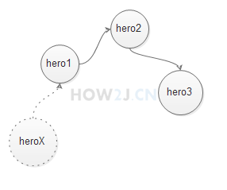

一、

1、序列

序列分先进先出FIFO,先进后出FILO

FIFO在Java中又叫Queue 队列 ；FILO在Java中又叫Stack 栈

2、LinkedList 与 List接口

与ArrayList一样，LinkedList也实现了List接口，诸如add,remove,contains等等方法。

3、双向链表 - Deque

除了实现了List接口外，LinkedList还实现了双向链表结构Deque，可以很方便的在头尾插入删除数据

什么是链表结构: 与数组结构相比较，数组结构，就好像是电影院，每个位置都有标示，每个位置之间的间隔都是一样的。

而链表就相当于佛珠，每个珠子，只连接前一个和后一个，不用关心除此之外的其他佛珠在哪里。

    public class TestCollection {
        public static void main(String[] args) {
            //LinkedList是一个双向链表结构的list
            LinkedList<Hero> ll =new LinkedList<Hero>();
            //所以可以很方便的在头部和尾部插入数据
            //在最后插入新的英雄
            ll.addLast(new Hero("hero1"));
            ll.addLast(new Hero("hero2"));
            ll.addLast(new Hero("hero3"));
            System.out.println(ll);
            //在最前面插入新的英雄
            ll.addFirst(new Hero("heroX"));
            System.out.println(ll);
            //查看最前面的英雄
            System.out.println(ll.getFirst());
            //查看最后面的英雄
            System.out.println(ll.getLast());
            //查看不会导致英雄被删除
            System.out.println(ll);
            //取出最前面的英雄
            System.out.println(ll.removeFirst());
            //取出最后面的英雄
            System.out.println(ll.removeLast());
            //取出会导致英雄被删除
            System.out.println(ll);
        }
    }

4、队列 - Queue

LinkedList 除了实现了List和Deque外，还实现了Queue接口(队列)。

Queue是先进先出队列 FIFO，常用方法：

offer 在最后添加元素； poll 取出第一个元素； peek 查看第一个元素

    public class TestCollection {
        public static void main(String[] args) {
            //和ArrayList一样，LinkedList也实现了List接口
            List ll =new LinkedList<Hero>();
            //所不同的是LinkedList还实现了Deque，进而又实现了Queue这个接口
            //Queue代表FIFO 先进先出的队列
            Queue<Hero> q= new LinkedList<Hero>();
            //加在队列的最后面
            System.out.print("初始化队列：\t");
            q.offer(new Hero("Hero1"));
            q.offer(new Hero("Hero2"));
            q.offer(new Hero("Hero3"));
            q.offer(new Hero("Hero4"));
            System.out.println(q);
            System.out.print("把第一个元素取poll()出来:\t");
            //取出第一个Hero，FIFO 先进先出
            Hero h = q.poll();
            System.out.println(h);
            System.out.print("取出第一个元素之后的队列:\t");
            System.out.println(q);
            //把第一个拿出来看一看，但是不取出来
            h=q.peek();
            System.out.print("查看peek()第一个元素:\t");
            System.out.println(h);
            System.out.print("查看并不会导致第一个元素被取出来:\t");
            System.out.println(q);
        }
    }