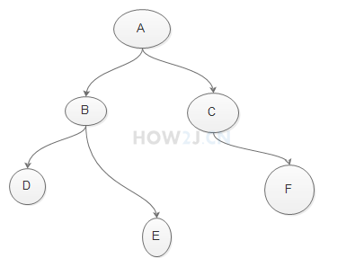
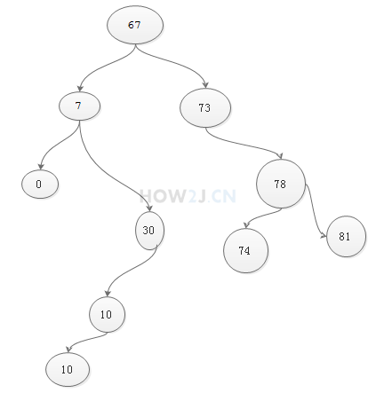

一、

1、二叉树概念

二叉树由各种节点组成

二叉树特点：

    每个节点都可以有左子节点，右子节点
    每一个节点都有一个值

    public class Node {
        // 左子节点
        public Node leftNode;
        // 右子节点
        public Node rightNode;
        // 值
        public Object value;
    }

2、二叉树排序-插入数据

假设通过二叉树对如下10个随机数进行排序
67,7,30,73,10,0,78,81,10,74
排序的第一个步骤是把数据插入到该二叉树中
插入基本逻辑是，小、相同的放左边，大的放右边
1. 67 放在根节点
2. 7 比 67小，放在67的左节点
3. 30 比67 小，找到67的左节点7，30比7大，就放在7的右节点
4. 73 比67大， 放在67的右节点
5. 10 比 67小，找到67的左节点7，10比7大，找到7的右节点30，10比30小，放在30的左节点。
   ...
   ...
6. 10比67小，找到67的左节点7，10比7大，找到7的右节点30，10比30小，找到30的左节点10，10和10一样大，放在左边

    public class Node {
    // 左子节点
    public Node leftNode;
    // 右子节点
    public Node rightNode;
    // 值
    public Object value;

    // 插入 数据
    public void add(Object v) {
        // 如果当前节点没有值，就把数据放在当前节点上
        if (null == value)
            value = v;
        // 如果当前节点有值，就进行判断，新增的值与当前值的大小关系
        else {
            // 新增的值，比当前值小或者相同
             
            if ((Integer) v -((Integer)value) <= 0) {
                if (null == leftNode)
                    leftNode = new Node();
                leftNode.add(v);
            }
            // 新增的值，比当前值大
            else {
                if (null == rightNode)
                    rightNode = new Node();
                rightNode.add(v);
            }
        }
    }
    public static void main(String[] args) {
        int randoms[] = new int[] { 67, 7, 30, 73, 10, 0, 78, 81, 10, 74 };
        Node roots = new Node();
        for (int number : randoms) {
            roots.add(number);
            }
        }
    }

