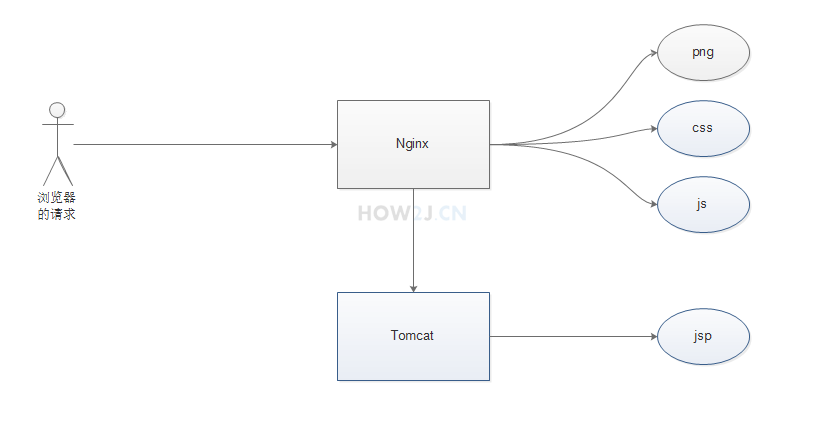
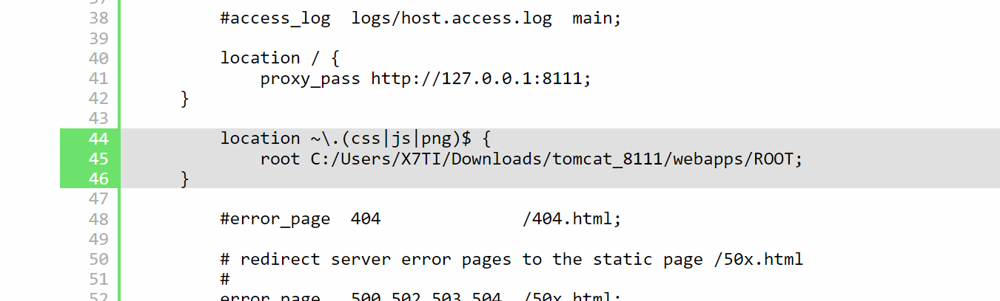
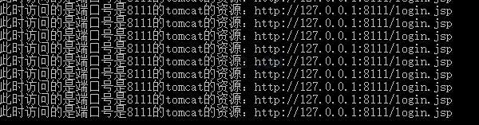

一、动静分离概念

所谓的动静分离就是指图片，css, js之类的都交给nginx来处理，nginx处理不了的，比如jsp 就交给tomcat来处理~

好处是nginx处理静态内容的吞吐量很高，比tomcat高多了，这样无形中提升了性能。

二、修改nginx.conf的配置

在locaction下面添加一个新的location:

        location ~\.(css|js|png)$ {
        	root C:/Users/X7TI/Downloads/tomcat_8111/webapps/ROOT;
	}

这表示所有的css js png访问都由nginx来做，访问的地址是

C:/Users/X7TI/Downloads/tomcat_8111/webapps/ROOT

（这里要注意，填写本地地址的时候，要用正斜杠 / 不要用反斜杠 \）

三、观察tomcat输入日志

在tomcat的输出日志里观察，确认所有的css,js,png都不会经过 tomcat，而是由nginx自己负责处理了
