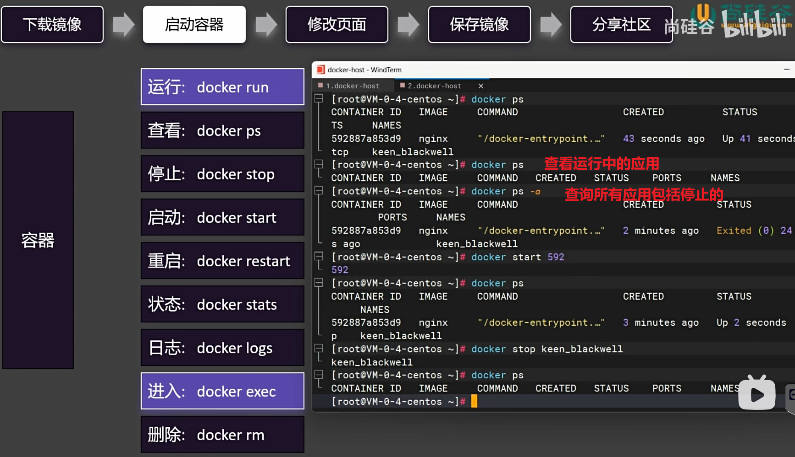

操作情景：

    启动一个Nginx，并将他的首页改为自己的页面，发布出去，让所有人都能使用

    下载镜像->启动容器->修改页面->报错镜像->分享社区

在下载指定应用的版本号时，需要到 [https://hub.docker.com/ ]() 去查询应用所包含的版本有哪些

    点进去有详细的应用说明和执行操作的相关命令

    Tags里面有应用的各种镜像，以及下载命令

    下载指定版本镜像、查看所有镜像、 删除镜像 “docker rmi +应用名：版本号”  或者 “docker rmi + 应用的唯一ID”

 

    ** docker rmi是删除镜像   docker rm是删除容器

    服务器映射Docker的端口不能重复，服务器的端口必须唯一，不同Docker的端口可以重复（因为一个服务器可以部署多个独立的Docker）

    将镜像打包成一个tar包

