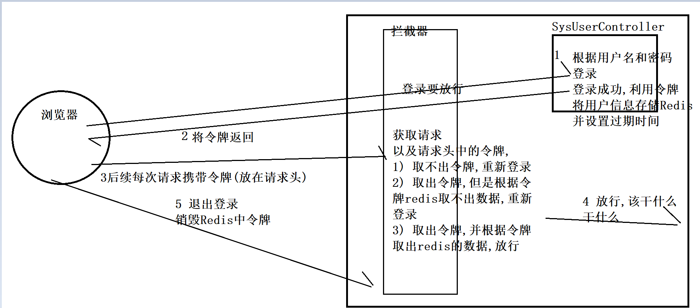

需求：实现没有登录时不能访问，并且每隔一段时间自动登录

一、 流程： 

1、根据用户名和密码进行登录，登录成功后，用令牌将用户信息用Redis存储并设置时间

2、返回令牌到前端，

3、之后发送请求时都携带着令牌（放在请求头）

4、请求发送到后端后，被拦截器拦截。然后拦截器获取请求，以及请求头中的令牌；

    （1）取不出令牌，请求不成功，需重新登录；
    
    （2）取出令牌，但是根据令牌Redis取不出数据，也需重新登录；
    
    （3）取出令牌成功，并根据令牌中的数据可放行；

4、放行之后，继续往下操作

5、退出登录，销毁Redis手中的令牌

二、思路

1、当用户登录成功后，将用户信息存储到Redis中，生成一个token，当做key，用户信息当做value，并设置过期时间为一小时。

然后将token返回给前端

2、前端登录成功后，从返回的数据取出token，再存储到Vuex和cookie中（vue-admin-template就是如此）

后续前端每次发请求时，都会在请求头中携带着这个token到后端

3、后端设置拦截器，从接收的每个请求判断有无token

    (1) 没有token，说明没有登录，然后响应回前端让其重新登录
    
    (2) 有token但是根据Redis取不出数据，说明过期了，同样响应会前端让其重新登录
    
    (3) 有token通过token从Redis取出数据，可放行

思考一下,如何响应给前端让其重新登录? 前端后端要统一使用JSON交互(即统一返回对象R)的,拦截器中如何返回R?

方案: 使用自定义异常类+全局异常处理

思路: 拦截器中返回指定异常类,然后全局异常处理类中捕获这些异常,统一返回指定的状态码即可

状态码多少? 

Vue-admin-template架子中设置了50008,50012,50014状态码

    50008: Illegal token;
    50012: Other clients logged in;
    50014: Token expired;
    r clients logged in;
    
    50014: Token expired;
