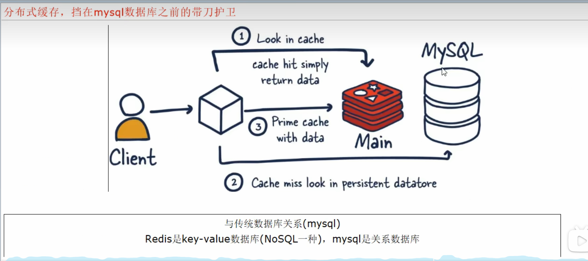

一、

1、Redis是什么

Remote Dictionary Server(远程字典服务)，是一个高性能的Key-Value数据库，提供了丰富的数据结构，
例如String、Hash、List、Set、SortedSet等等。

数据是存在内存中的，同时Redis支持事务、持久化、LUA脚本、发布/订阅、缓存淘汰、流技术等多种功能特性提供了主从模式、
Redis Sentinel和Redis Cluster集群架构方案。

二、能干什么

分布式缓存，挡在mysql数据库之前的带到侍卫

    二八原则
    在业务上80%（查询操作） 20%（写入操作），redis可以进行代替mysql进行查询操作，减轻mysql（关系型数据库）的负担

1、与传统数据库关系(MySQL)

    ·Redis是key-value数据库(NoSQL一种)，MySQL是关系型数据库
    
    ·Redis数据操作主要在内存，而MySQL主要存储在磁盘
    
    ·Redis在某一些场景使用中要明显优于MySQL，比如计数器、排行榜等方面
    
    ·Redis通常用于一些特定场景，需要与MySQL一起配合使用
    
    两者并不是相互替换和竞争的关系，而是共用和配合使用

2.内存存储和持久化（RDB和AOF）

    Redis支持异步将内存中的数据写到硬盘上，同时不影响继续服务

3.高可用架构搭配

    单机、主从、哨兵、集群

4.缓存穿透、击穿、雪崩

5.分布式锁

6.队列

    Redis提供list和Set操作，这使得Redis能作为一个很好的消息队列平台来使用。
    我们常通过Redis的队列功能做购买限制。比如到了节假日或者推广期间，进行一些活动，
    对用户购买行为进行限制，限制今天只能购买几次商品或者一段时间内只能购买一次。也比较适合使用。

7.排行榜+点赞

    在互联网应用中，有各种各样的排行榜，如电商网站的月度销量排行榜、社交APP的礼物排行榜、小程序的投票排行榜等等。Redis提供的zset数据类型能够快速实现这些复杂的排行榜。
    
    比如小说网站对小说进行排名，根据排名，将排名靠前的小说推荐给用户。

三、优势

    ​ 性能极高-Redis读的速度是110000次/秒，写的速度是81000次/秒
    
    ​ Redis数据类型丰富，不仅仅支持简单的Key-Value类型的数据，同时还提供list，set，zset，hash等数据结构的存储
    
    ​ Redis支持数据的持久化，可以将内存中的数据保持在磁盘中，重启的时候可以再次加载进行使用
    
    ​ Redis支持数据的备份，即master-slave模式的数据备份

四、去哪下

官网地址:

    英文：https://redis.io/
    
    中文：http://www.redis.cn/ https://www.redis.com.cn/documentation.html
    
    安装包：https://redis.io/download/，选择redis7.0版本即可

Redis源码地址：https://github.com/redis/redis

Redis在线测试地址(不用下载也能玩)：https://try.redis.io/

Redis命令参考：http://doc.redisfans.com/

五、部分新特性总览：

    大体和之前的redis版本保持一致和稳定，主要是自身底层性能和**资源利用率上的优化和提高**，如果生产上系统稳定，**不用着急升级到最新redis7版本**，如果从零开始新系统，直接上redis7.0-GA版。

| 多AOF文件支持                       | 7.0 版本中一个比较大的变化就是 aof 文件由一个变成了多个，主要分为两种类型:基本文件(base files)、增量文件(incr files)，请注意这些文件名称是复数形式说明每一类文件不仅仅只有一个。在此之外还引入了一个清单文件(manifest) 用于跟踪文件以及文件的创建和应用顺序(恢复) |
| ------------------------------ | ---------------------------------------- |
| config命令增强                     | 对于Config Set 和Get命令，支持在一次调用过程中传递多个配置参数。例如，现在我们可以在执行一次Config Set命今中更改多个参数: config set maxmemory 10000001 maxmemory-clients 50% port 6399 |
| 限制客户端内存使用 Client-eviction | 一旦 Redis 连接较多，再加上每个连接的内存占用都比较大的时候， Redis总连接内存占用可能会达到maxmemory的上限，可以增加允许限制所有客户端的总内存使用量配置项，redis.config 中对应的配置项 //两种配置形式:指定内存大小、基于 maxmemory 的百分比。 maxmemory-client 1g maxmemory-client 10% |
| listpack紧凑列表调整                 | listpack 是用来替代 ziplist 的新数据结构，在 7.0 版本已经没有 ziplist 的配置了 (6.0版本仅部分数据类型作为过渡阶段在使用）listpack已经替换了ziplist类似hash-max-ziplist-entries 的配置 |
| 访问安全性增强ACLV2                   | 在redis.conf配置文件中protected-mode默认为yes，只有当你希望你的客户端在没有授权的情况下可以连接到Redis server的时候可以将protect-mode设置为no |
| redis function                 | Redis函数，一种新的通过服务端脚本扩展Redis的方式，函数与数据本身一起存储。简言之，redis自己要去抢夺Lua脚本的饭碗 |
| RDB保存时间调整                      | 将持久化文件RDB的保存规则发生了改变，尤其是时间记录频度变化          |
| 命令新增和变动                        | Zset (有序集合)增加 ZMPOP、BZMPOP、ZINTERCARD 等命令 Set (集合)增加 SINTERCARD 命令 LIST(列表)增加 LMPOP、BLMPOP ，从提供的键名列表中的第一个非空列表键中弹出一个或多个元素。 |
| 性能资源利用率、安全等改进                  | 自身底层部分优化改动，Redis核心在许多方面进行了重构和改进主动碎片整理V2:增强版主动碎片整理，配合Jemalloc版本更新，更快更智能，延时更低 HyperLogLog改进:在Redis5.0中，HyperLogLog算法得到改进，优化了计数统计时的内存使用效率，7更加优秀更好的内存统计报告 如果不是为了API向后兼容，我们将不再使用slave一词......（政治正确） |
