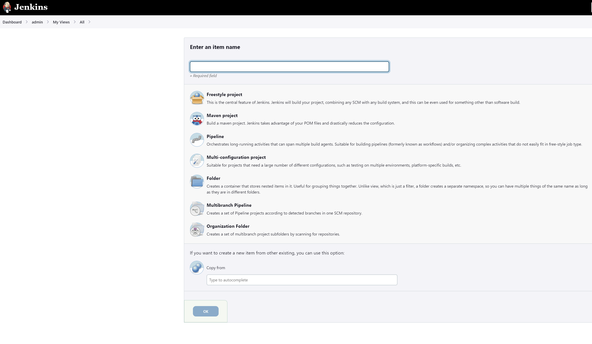

一、JenKins 中的new Item各个选项应该怎选择

介绍了Jenkins中六种主要任务类型，包括FreestyleProject（灵活配置）、Pipeline（代码驱动的构建流程）、
MulticonfigurationProject（多环境测试）、OrganizationFolder（组织级CI/CD）、MultibranchPipeline（多分支流水线）
和Folder（任务组织）。根据项目需求选择适合的类型以优化构建过程。

