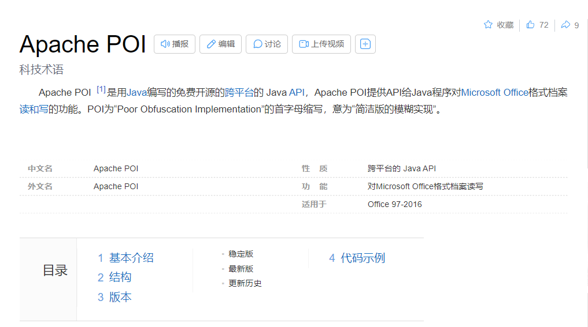
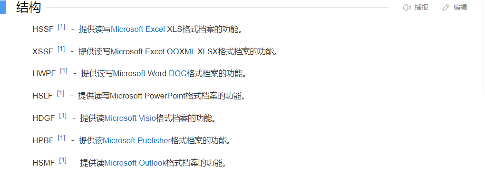
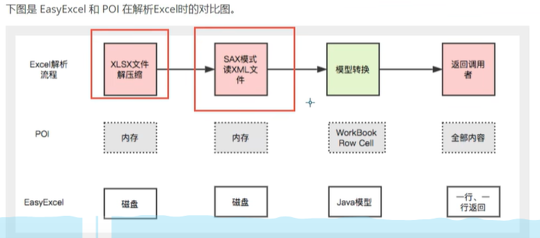

一、使用场景
    
1、将用户信息导出为Excel

2、将Excel表中的数据录入到网站数据库

操作Excel目前比较流行的就是 Apache POI和 阿里巴巴的 EasyExcel

二、官网介绍

1、Apache POI 官网：https://poi.apache.org/

2、阿里巴巴的 EasyExcel 官网： https://easyexcel.opensource.alibaba.com/

三、Apache POI和 EasyExcel的区别

1、内存问题
    Apache POI是先加载到内存，再一行一行进行读取操作(可能会导致内存溢出)；EasyExcel是通过磁盘取一行操作一行。
    本质上是拿时间换空间。

