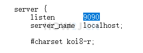

一、启动方式

1、双击 nginx.exe应用 

2、命令行  start nginx

二、关闭方式

1、用任务管理器关闭，nginx启动之后，在任务管理里有两个nginx进程，这个是正常的，一个是1个守护进程 1个工作进程，得手动分别关闭。

2、命令行 nginx -s stop

三、重启方式

nginx -s reload

四、端口号修改

打开nginx目录下的conf/nginx.conf文件，然后找到listen 80,修改为9090，关闭nginx再启动，就可以通过如下地址访问了：

http://127.0.0.1:9090/

