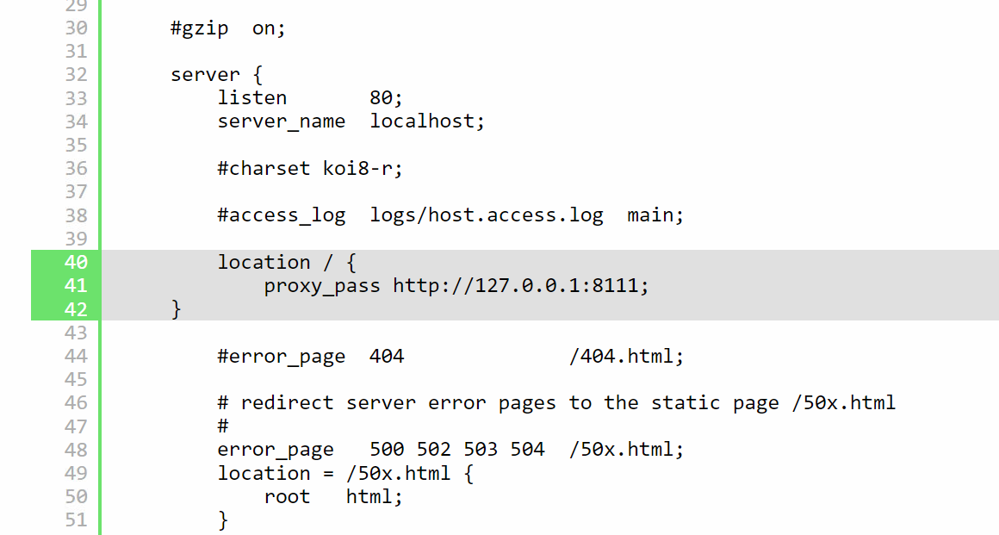

一、理解什么是反向代理

先说正向代理，比如要访问youtube,但是不能直接访问，只能先找个翻墙软件，通过翻墙软件才能访问youtube. 翻墙软件就叫做正向代理。
所谓的反向代理，指的是用户要访问youtube,但是youtube悄悄地把这个请求交给bilibili来做，那么bilibili就是反向代理了。
在当前教程指的就是访问nginx,但是nginx把请求交给tomcat来做。

二、配置反向代理

1、修改nginx.conf

location / 表示处理所有请求
proxy_pass http://127.0.0.1:8111; 表示把请求都交给http://127.0.0.1:8111来处理

重启Nginx :nginx -s reload

然后访问地址：http://127.0.0.1:80,发现已经反向代理到tomcat了 http://127.0.0.1:8111

三、反向代理的好处和意义

1、负载均衡：

好处：负载均衡可以将传入的请求分发到多个后端服务器，从而提高系统的性能和可靠性，同时避免单个服务器过载。
例子：假设有一个电子商务网站，每天有大量用户同时访问，使用Nginx的负载均衡功能可以将请求分发到多个商品服务器上，确保每个用户都能够快速访问到商品信
息，而不会因为服务器负载过高而导致响应变慢或请求失败。

2、高并发支持：

好处：Nginx采用异步非阻塞的事件驱动模型，能够高效地处理大量并发请求，适合高流量的网站和应用。
例子：一家新闻网站在重要新闻事件发生时，会有大量用户同时访问网站，使用Nginx可以有效地处理这些并发请求，确保每个用户都能够及时获取到最新的新闻内容
，而不会因为服务器压力过大而导致响应延迟或宕机。

3、缓存（动静分离）：

好处：Nginx可以缓存静态文件或动态内容，减轻后端服务器的负载，提高响应速度，并且可以通过配置实现灵活的缓存策略。
例子：一个社交媒体平台上的用户头像、CSS文件等静态资源相对稳定，可以使用Nginx进行缓存，减少后端服务器的负载，提高用户访问速度。同时，也可以缓存动
态生成的内容，如热门文章或热门评论，以减少数据库查询压力，提高网站整体性能。

4、安全性：

好处：Nginx具有强大的安全特性，可以通过配置实现访问控制、防止恶意攻击、防范DDoS等安全措施。
例子：一个企业的内部应用可能只能在公司内部访问，可以使用Nginx进行访问控制，只允许特定IP范围的用户访问，确保公司数据的安全。此外，Nginx也可以通过
配置实现防火墙、反向代理等功能，提高系统的安全性，防止恶意攻击和未经授权的访问。

总的来说，Nginx作为反向代理服务器可以提高系统的性能、可靠性和安全性，为Web应用的稳定运行提供了重要支持。