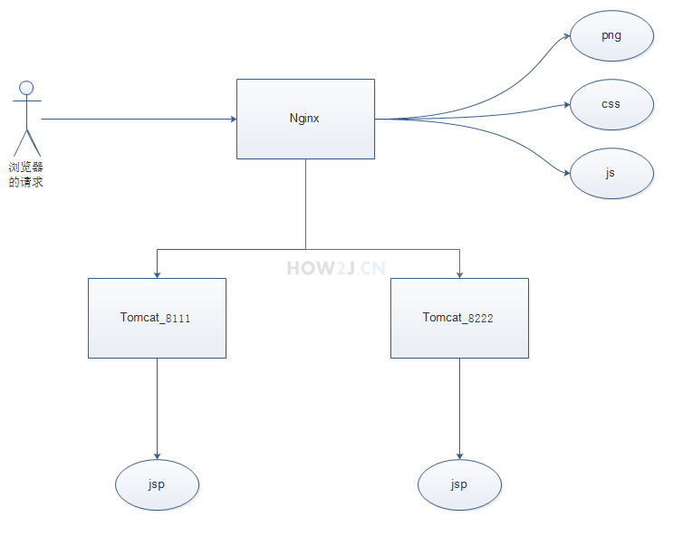
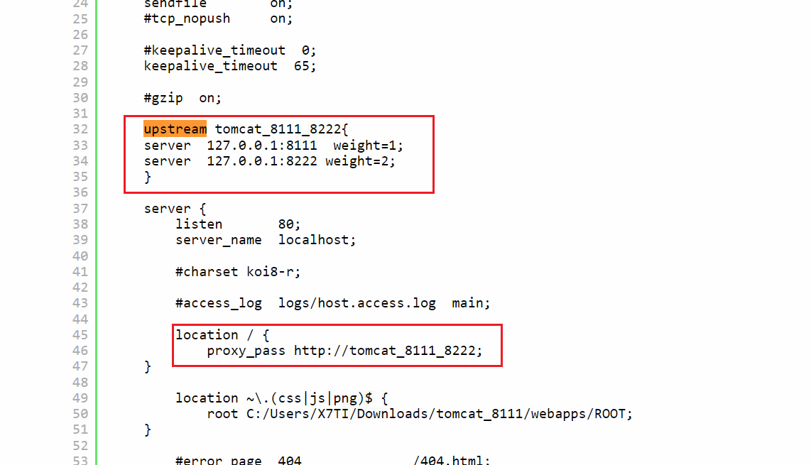

一、负载均衡的概念

负载均衡的概念就是当访问量很大的时候，一个 Tomcat 吃不消了，这时候就准备多个 Tomcat，由Nginx按照权重来对请求进行分配，从而缓解单独一个Tomcat
受到的压力

二、修改nginx.conf

首先增加一个upstream ，用来指向这两个tomcat（weight表示权重，值越大，被分配到的几率越大。）

    upstream tomcat_8111_8222{
	server	127.0.0.1:8111 weight=1;
	server	127.0.0.1:8222 weight=2;
    }

然后修改location，反向代理到上述配置。

        location / {
        	proxy_pass http://tomcat_8111_8222;
	}

三、重启Nginx
观察日志，是否配置成功